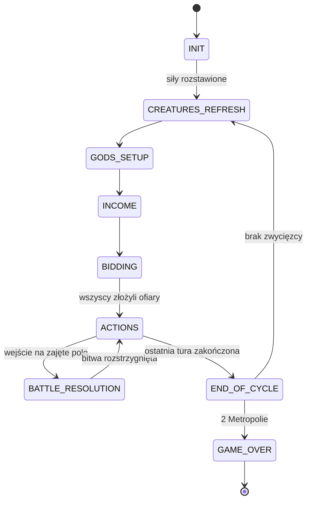
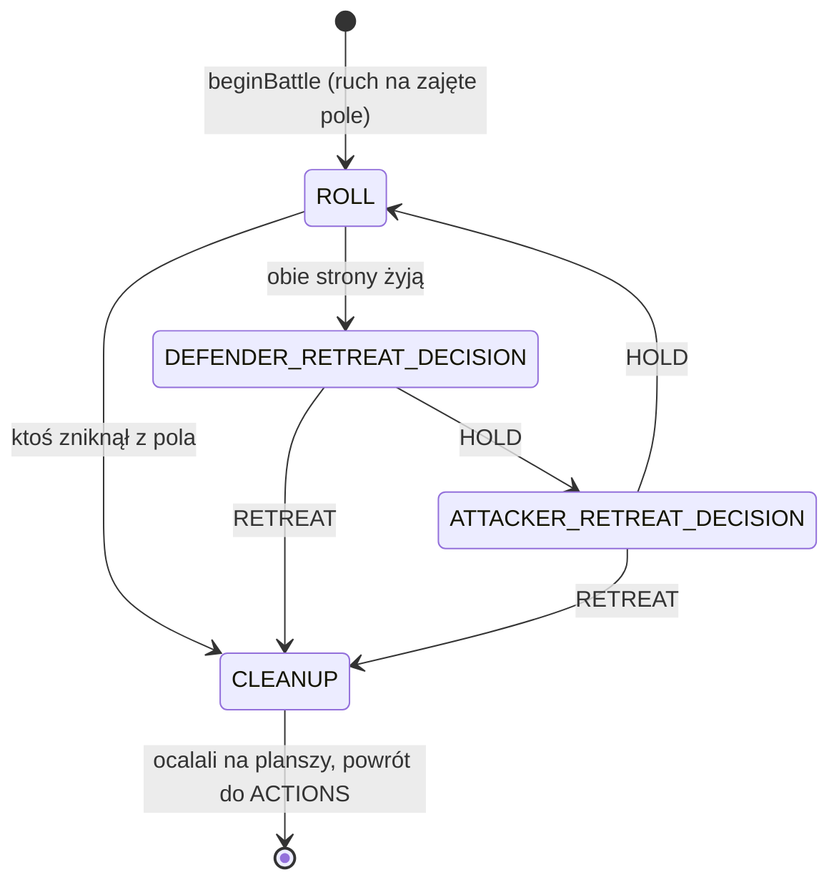

# Cyklady: model stanu gry (podstawka + Hades + Monumenty)

Warstwa danych cyfrowej wersji gry: typy stanu, graf planszy, tory i talie,
maszyna stanów faz, dane wyliczane i walidacja niezmienników. Kod jest
w TypeScript (tryb `strict`), a komentarze po polsku.

```bash
npm install
npm run check      # tsc (strict) + testy (node --test)
```

## Mapa wymagań na kod

| Wymaganie | Gdzie w kodzie |
|---|---|
| JZ, Filozofowie, Kapłani, Kapłanki, kolor | `PlayerState` (`src/model/player.ts`) |
| Magiczne Przedmioty | `PlayerState.magicItems`, definicje `MagicItemDef` (`catalog.ts`) |
| Jednostki: Oddziały, Floty, Nieumarli | zapas: `PlayerReserve`; plansza: `LandForce` / `NavalForce`; suma: `PlayerView.units` |
| Herosi | zapas: `PlayerReserve.heroes`; wyspa: `LandForce.heroes`; encja: `HeroState`; suma: `PlayerView.heroes` |
| Pozycja w licytacji | `PlayerView.offerings` i `PlayerView.turnOrderPositions` (wyliczane z torów) |
| Node Wyspy | `IslandNode` (`board.ts`): właściciel, sloty budynków, Metropolii i Monumentu, dobrobyt, garnizon |
| Node Pola Morskiego | `SeaNode`: sąsiedztwo, floty, `tradeRoute` (pole handlowe) |
| Tor Kolejności | `TurnOrderTrack` (`trackers.ts`) |
| Tor Licytacji Bogów | `GodTrack` + słownik `God` (Ares, Posejdon, Zeus, Atena, Apollo, Hades) |
| Tor i Talia Stworów oraz Herosów | `CreatureMarket` (pola 2/3/4 JZ, talia, stos), `refreshCreatureMarket` |
| Kolumna Hadesa 0–9 | `HadesThreatTrack`, `advanceHadesThreat`, `consumeHadesSummon`, rzut: `advanceHadesColumn` |
| Pula Monumentów | `MonumentPool` (talia, karty graczy `dealt`, figurki) i `IslandNode.monumentSlot` |
| Dodatki w cyklu gry | `src/engine/expansions/` (moduły zdarzeń) + `src/engine/cycle.ts` (`CYCLE_HOOKS`) |
| Przebieg partii | `src/engine/orchestrator.ts`: fazy automatyczne, `pendingActors`, `endTurn` |
| Sieć (Single Player / LAN) | `src/net/`: `GameServer` (`IGameServer`), `GameClient`, protokół, kodeki, transporty; opis w [SIEC.md](SIEC.md) |
| Lobby: kolory, miasta, dodatki, boty, gotowość, start | `Room.handleLobby` (`src/net/room.ts`), wiadomość `LOBBY_ACTION` (`protocol.ts`) |
| Wykrywanie serwerów LAN (UDP) i łączenie ręczne | `DiscoveryBeacon`, `DiscoveryListener`, `connectManually` (`src/net/discovery.ts`) |
| Bezpieczne rzuty kośćmi (serwer, CSPRNG) | `createSecureRng`: ChaCha20 z tajnym kluczem (`src/model/rng.ts`), podmiana generatora w `Room` |
| Raport starcia (Fortece, Porty, herosi…) | `ScoreBreakdown.modifiers` (`src/model/battle.ts`, `battleScore` w `src/engine/combat.ts`), `BATTLE_EVENT` |
| Licytacja w czasie rzeczywistym, zegar tury, ruchy pasywne | `BIDDING_EVENT`, `TURN_UPDATE`, `describeTurn` (`src/net/turnClock.ts`), limity w `Room` |
| Rozłączenie i powrót (60 s, pełna migawka) | okno powrotu w `Room`, ping w `src/net/websocket.ts`, `GameClient.reconnect` i `autoReconnect` (`src/net/reconnect.ts`) |
| Wersja Godot 4 (GDScript, ENet): sieć i stan gry | `godot/scripts/autoload/NetworkManager.gd`, `godot/scripts/autoload/GameStateManager.gd`; instrukcja w [godot/README.md](godot/README.md) |
| Wersja Godot 4: plansza, wybór pól i podświetlanie ruchów | `godot/scenes/board/Board.tscn`, `godot/scripts/ui/` (`board.gd` z `highlight_valid_moves`, `TerritoryNode.gd`), `godot/assets/shaders/territory.gdshader`, reguły wspólne dla serwera i planszy w `godot/scripts/core/MoveRules.gd`; opis w rozdziale 3 [godot/README.md](godot/README.md) |
| Wersja Godot 4: licytacja (tory ofiar, kapłani, Apollo, przebicie) | `godot/scenes/ui/BiddingBoard.tscn`, `godot/scripts/ui/` (`BiddingBoardUI.gd`, `OfferingTrack.gd`), reguły wspólne dla serwera i panelu w `godot/scripts/core/BidRules.gd`, powiadomienie `rpc_notify_bid_displaced` → `GameStateManager.bid_displaced`; opis w rozdziale 4 [godot/README.md](godot/README.md) |
| Wersja Godot 4: baza treści (bogowie, stwory i herosi, Monumenty) | `godot/scripts/autoload/GameData.gd` (autoload `GameData`): stałe `GODS`, `CREATURES`, `HEROES`, `MONUMENTS`, talie zależne od dodatków, `validate()`; plan prac w [TASKS.md](TASKS.md) |
| Wersja Godot 4: rekrutacja, tor stworów, Metropolie i koniec gry | `godot/scripts/core/RecruitRules.gd` i `godot/scripts/core/CreatureRules.gd` (reguły wspólne dla serwera i UI), `GameStateManager.apply_recruit`, `apply_buy_creature`, `apply_swap_creature`, efekty stanowe (Metropolie) w `_commit`, RPC `rpc_recruit`, `rpc_buy_creature`, `rpc_swap_creature`; opis w rozdziale 10 [godot/README.md](godot/README.md) |
| Wersja Godot 4: interfejs tur bogów | `godot/scenes/ui/` i `godot/scripts/ui/`: `ActionPanel` (rekrutacja i budowa), `CreatureTrack` (tor stworów, cel mocy wskazywany na planszy przez `Board.pick_targets`), `MetropolisDialog` (wybór wyspy, `pending_metropolis`, RPC `rpc_place_metropolis`), `GameOverPanel` (wynik z `result`); opis w rozdziale 10 [godot/README.md](godot/README.md) |
| Mapa demonstracyjna dla 3–5 graczy z lobby | `src/examples/archipelago.ts` (`archipelagoLobby`), przykłady `lanServer.ts` i `lanBrowser.ts` |
| Maszyna stanów | `phases.ts` (stany i konteksty), `stateMachine.ts` (przejścia, strażnicy, haki) |

## Zasady projektu

1. **Jedno źródło prawdy.** `PlayerState` trzyma tylko to, co leży przed
   graczem. Wszystko, co fizycznie leży gdzie indziej (jednostki na planszy,
   znacznik ofiary na torze), jest wyliczane przez selektory (`getPlayerView`).
   Dzięki temu nie da się zapisać sprzecznego stanu.
2. **Model stref.** Każda karta, heros, przedmiot i figurka leży w dokładnie
   jednej strefie (talia, pole toru, zapas, wyspa, bitwa).
   `validateGameState` to sprawdza.
3. **Zasady zachowania.** Zapas + plansza + bitwa = stała pula figurek
   (osobno dla każdego gracza i dla neutralnej puli nieumarłych).
4. **Niemutowalny, czysty JSON.** Pola są `readonly`, w stanie nie ma klas
   ani `Map`. Stan można zapisać, przesłać i odtworzyć 1:1, co daje undo
   i powtórki.
5. **Determinizm.** Stan generatora losowego (`rng`) jest częścią stanu.
   To samo ziarno i te same akcje dają ten sam wynik.
6. **Zasady w danych.** Liczby z instrukcji są w `RulesetConfig`, a logika
   kart w silniku zasad (karty niosą tylko `EffectKey`).
7. **Typy markowane.** `IslandId` nie da się pomylić z `SeaId` ani z `PlayerId`.

## Maszyna stanów



- **Tabela przejść** (`PHASE_TRANSITIONS`): nieistniejąca krawędź to błąd
  kompilacji typu `TransitionKey` i błąd w runtime.
- **Strażnicy** (`EDGE_RULES`): `ready` określa, czy wolno już opuścić fazę,
  a `consistent` sprawdza, czy kontekst fazy docelowej pasuje do stanu.
- **Haki** (`PhaseHooks`): silnik zasad wpina efekty wejścia i wyjścia,
  a model sam wykonuje tylko granicę cyklu (numer cyklu, zatwierdzenie toru
  kolejności, czyszczenie toru bogów).
- **Bitwa jako podstan** (automat ze stosem): `beginBattle` zamraża kontekst
  ACTIONS, a `endBattle` go przywraca, więc tura toczy się dalej z zachowanymi
  licznikami. Strażnicy wymuszają przeniesienie figurek do bitwy i z powrotem.
- **GAME_OVER** to stan końcowy dodany do listy faz ze specyfikacji.

## Silnik licytacji (`src/engine/bidding.ts`)

Czyste funkcje działające na `GameState` w fazie BIDDING. Błędy walidacji są
zwracane jako wartości `{ ok: false, error: { code, ... } }`, a
`describeRejection` zamienia je na komunikat dla gracza.

| Funkcja | Rola |
|---|---|
| `applyBid(state, komenda)` | jeden ruch: ofiara (`OFFER`) albo Apollo (`APOLLO`) |
| `currentBidder` / `legalBids` | kto licytuje, jaki bóg jest zakazany, przedziały kwot (UI, boty) |
| `runBidding(state, strategia)` | pętla przelicytowań aż do ustabilizowania toru, z limitem ruchów |
| `settleBidding` | pobranie opłat (`max(1, kwota − kapłani)`) i zapis rozliczenia |
| `closeBidding` | rozliczenie + przejście do ACTIONS z kolejnością akcji |
| `computeSettlement` | podgląd rozliczenia bez zmiany stanu |

Przebity gracz ma pierwszeństwo przed kolejką (`BiddingPhase.displaced`)
i nie może wrócić na boga, z którego właśnie wypadł. Łańcuch trwa, aż ktoś
położy znacznik na wolnym bogu albo u Apolla. Pętla zawsze się kończy: każde
przebicie podnosi ofertę o co najmniej 1 JZ, oferty są ograniczone portfelami,
a Apollo jest zawsze dostępny. Strażnik BIDDING → ACTIONS wymaga rozliczenia,
więc opłat nie da się pominąć ani pobrać dwa razy.

## Nawigacja i ruch (`src/engine/pathfinding.ts`, `src/engine/movement.ts`)

| Funkcja | Rola |
|---|---|
| `fleetReach` | BFS po polach morskich: zasięg grupy flot (3 pola), miejsca bitew |
| `findFleetBridge` / `troopReach` | BFS z wielu źródeł po mostach z flot: najkrótszy łańcuch dla wojsk |
| `fleetBridgeComponents` | union-find: składowe mostów gracza do wielu zapytań naraz |
| `planFleetMove` / `planTroopMove` | walidacja ruchu bez tury i kosztu (podgląd w UI, efekty kart) |
| `moveFleets` / `moveTroops` | akcja Posejdona / Aresa: tura, koszt, wykonanie, bitwa |
| `checkLastIsland` | reguła ostatniej wyspy |

Szczegółowy opis grafu, algorytmów i reguł znajduje się w [NAWIGACJA.md](NAWIGACJA.md).

## Silnik bitwy (`src/engine/combat.ts`)

`stepBattle(state, komenda)` wykonuje jeden krok bitwy. Bieżący krok
(`battle.step`) wyznacza, jaka komenda jest dozwolona:



Strona bez dozwolonego celu odwrotu jest pomijana, a kolejność decyzji
wynika z `rules.combat.retreatOrder`.

| Element | Reguła |
|---|---|
| Wynik strony | kość `[0, 1, 1, 2, 2, 3]` + jednostki (z nieumarłymi i siłą herosów) + modyfikatory |
| Obrona lądu | +1 za Fortecę na wyspie (Metropolia liczy się jak Forteca) |
| Obrona morza | +1 za Port na sąsiednich wyspach obrońcy (Metropolia liczy się jak Port) |
| Ulisses | po stronie atakującego zeruje premie Fortec i Metropolii obrońcy |
| Port Wojenny | floty obrońcy wokół bronionej wyspy liczą się jak oddziały |
| Wielka Cytadela Aresa | atak na wyspę z ≥ 1 oddziałem jest odrzucany już przy ruchu (`ATTACK_BLOCKED`) |
| Runda | niższy wynik traci 1 jednostkę, a remis oznacza stratę po obu stronach |
| Odwrót | ląd: łańcuchem własnych flot na własną lub niczyją wyspę; morze: na sąsiednie pole własne lub puste |

Polegli wracają do zapasu od razu (nieumarli do puli Hadesa, a poległy heros
opuszcza grę, a jego karta trafia na stos odrzuconych). Krok CLEANUP odstawia
ocalałych, przekazuje zdobytą wyspę razem z budynkami i wraca do przerwanej
tury. Bitwa zawsze się kończy, bo każda runda usuwa co najmniej jedną jednostkę.

## Dodatki jako moduły zdarzeń cyklu (`src/engine/expansions/`)

Dodatek to obiekt `ExpansionModule` z nazwą, warunkiem włączenia
i funkcjami obsługi zdarzeń. Każda funkcja jest czysta: dostaje stan
i zwraca nowy stan. `cycle.ts` wpina je w haki maszyny stanów
(`CYCLE_HOOKS`) według jednej zasady: najpierw podstawka, potem dodatki
w kolejności z rejestru.

| Zdarzenie | Kiedy | Hades | Monumenty |
|---|---|---|---|
| `gameStart` | wyjście z INIT | – | rozdanie po 1 losowej karcie na gracza |
| `godsRevealed` | GODS_SETUP, po losowaniu bogów | rzut 2 kośćmi na Kolumnę; na 9 Hades zastępuje boga nad Apollem | – |
| `incomeCollected` | INCOME, po wypłacie dochodu | zerowanie wypłaconych pul Nekropolii | – |
| `cycleEnd` | wejście do END_OF_CYCLE | po cyklu z Hadesem nieumarli wracają do puli | – |
| `unitsDestroyed` | zginęła zwykła jednostka (silnik bitwy) | każda Nekropolia odkłada 1 JZ | – |
| `stateBased` | po każdej komendzie, przy wejściu do ACTIONS i END_OF_CYCLE | – | Monument staje, gdy gracz ma wymagane budynki |

Akcje w turze Hadesa: `recruitUndead` (nieumarłe oddziały na własnych
wyspach, nieumarłe floty przy własnych wyspach, z rosnącym kosztem
i limitem na turę) oraz `buildNecropolis` (najwyżej jedna na wyspę).
Dochód z Nekropolii jest częścią `expectedIncome`, a pula należy do
budynku, więc po zdobyciu wyspy przechodzi na nowego właściciela.
Gigant (`creatures.ts`) niszczy budynki w slotach, ale nie Monumenty.

Orkiestrator woła `applyStateBasedEffects` po każdej udanej komendzie
gracza i przekazuje `CYCLE_HOOKS` do `transition`, `closeBidding`
i `stepBattle` / `runBattle`.

## Warstwa sieciowa (`src/net/`)

Serwer jest autorytatywny: klient wysyła intencje, a silnik na serwerze je
waliduje i wykonuje. Każdy klient dostaje własną projekcję stanu (bez
generatora losowego, kolejności talii ani cudzego złota), pełną albo
w postaci łatki JSON Patch. Single Player i LAN korzystają z tej samej
klasy `GameServer`: Single Player tylko przez Local Loopback, a LAN
dodatkowo przez WebSocket. Przed startem pokój działa jako lobby (kolory,
miasta, dodatki, boty, gotowość, start przez hosta), a serwer LAN ogłasza
się w sieci lokalnej przez UDP. Gracz może też połączyć się ręcznie po
adresie IP i porcie. W trakcie partii kośćmi rzuca serwer generatorem
ChaCha20 z tajnym kluczem, a raport każdej rundy (z modyfikatorami) trafia
naraz do obu stron. Każda decyzja ma limit czasu z ruchem pasywnym,
a rozłączony gracz ma 60 s na powrót z pełną migawką stanu. Szczegóły,
diagramy przepływu i katalog wiadomości są w [SIEC.md](SIEC.md).

## Założenia do weryfikacji z instrukcją

Oznaczone w kodzie jako `[zweryfikuj]` albo opisane w komentarzach:

- `startingGold = 5` oraz liczba figurek nieumarłych (8/8) to wartości robocze.
- Liczba bogów zależnie od liczby graczy `{3: 2, 4: 3, 5: 4}`. Wariant
  2-osobowy wymaga osobnej konfiguracji (model obsługuje kilka znaczników
  ofiary na gracza).
- Ruch kart na torze stworów: karty zsuwają się na tańsze pola, a nowe wchodzą
  od pola za 4 JZ.
- Kolejność licytacji w następnym cyklu to kolejność kończenia tur bogów
  (`finishGodTurn`).
- Hades: rzuca się dwiema kośćmi bitewnymi (ścianki 0–3). Koszty nieumarłych
  wynoszą 0, 1, 2, 3 JZ (limit 4 na rodzaj i turę), a Nekropolia kosztuje 2 JZ.
  Nieumarłą flotę stawia się na polu przy własnej wyspie. Zniszczenie
  Nekropolii przez Giganta przepada razem z jej pulą.
- Monumenty: wymagane budynki mogą stać na różnych wyspach, a Metropolia
  liczy się jak komplet. Figurka staje na wyspie gracza z wolnym miejscem na
  Monument; bez takiej wyspy karta czeka. Postawiony Monument zostaje, nawet
  gdy wymagane budynki znikną. Gigant nie niszczy Metropolii.
- Źródło Teatru (który bóg lub efekt go buduje) ustala silnik zasad.
- Ruch: nieumarłe floty nie płyną w ruchu Posejdona, ale tworzą most dla
  wojsk. Koszt ruchu wynosi 1 JZ (zob. NAWIGACJA.md, sekcja 6).
- Bitwa: kolejność strat to nieumarli, potem zwykłe jednostki, a na końcu
  herosi (od najsłabszego). Floty wspierające z Portu Wojennego podnoszą wynik
  obrońcy, ale nie giną w bitwie lądowej. Porty liczą się tylko na wyspach obrońcy.
- Licytacja: gracze Apolla wykonują akcje w kolejności przybycia. W wariancie
  z dwoma znacznikami zniżka od kapłanów liczy się osobno dla każdej ofiary,
  a suma kosztów ofiar gracza nie może przekroczyć jego złota.

## Następne kroki

1. **Silnik zasad:** pozostałe komendy gracza (dary bogów, rekrutacja
   i budowa podstawki, zakup stworów z wywołaniem ich efektów, tura Apolla
   ze znacznikiem dobrobytu) oraz orkiestrator, który po każdej komendzie
   stosuje efekty stanowe.
   W wersji Godot rekrutacja, stwory, Metropolie i koniec gry już działają
   (zob. TASKS.md), a silnik TS może je przejąć z tamtych reguł.
2. **Sieć:** limity liczby wiadomości, tryb obserwatora, wybór mapy
   w lobby i sprawdzalne rzuty (zob. SIEC.md, sekcja 12).
3. **Dane z pudełka:** mapy dla 2–5 graczy, pełny katalog kart, Monumentów
   i przedmiotów.
