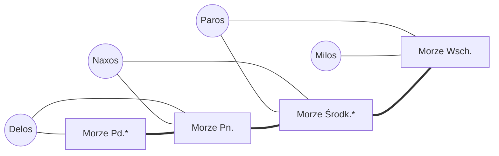

# Nawigacja i walidacja ruchów

Moduły: [`src/engine/pathfinding.ts`](src/engine/pathfinding.ts) (algorytmy
grafowe) i [`src/engine/movement.ts`](src/engine/movement.ts) (walidacja
i wykonanie ruchów). Testy: `test/pathfinding.test.ts`, `test/movement.test.ts`.

## 1. Struktura grafu planszy

Plansza to graf nieskierowany **G = (W ∪ M, E_WM ∪ E_MM)**:

| Element | Znaczenie | W kodzie |
|---|---|---|
| W | wyspy | `BoardGraph.islands: Record<IslandId, IslandNode>` |
| M | pola morskie | `BoardGraph.seas: Record<SeaId, SeaNode>` |
| E_WM | wybrzeża: wyspa sąsiaduje z polem morskim | `IslandNode.adjacentSeas` ↔ `SeaNode.adjacentIslands` |
| E_MM | cieśniny: dwa pola morskie sąsiadują | `SeaNode.adjacentSeas` |

**Krawędzi wyspa–wyspa nie ma.** Wyspy stykają się tylko z morzem, więc
każde przejście między wyspami prowadzi przez co najmniej jedno pole morskie.
To zasadniczy powód, dla którego desant wymaga floty.

Reprezentacja:
- **Listy sąsiedztwa w węzłach.** Wyspy i morza leżą w dwóch osobnych
  tabelach, a typ ID (`IslandId` / `SeaId`) jednoznacznie wskazuje tabelę.
  Dostęp do węzła kosztuje O(1), a kompilator nie pozwala pomylić tabel.
- **Symetria z konstrukcji.** W `MapDef` każdą krawędź zapisuje się raz,
  a `createBoard` buduje obie strony. `validateGameState` dodatkowo sprawdza
  symetrię wczytanych zapisów.
- **Stan na węzłach.** `SeaNode.fleet` i `IslandNode.garrison` należą
  w stanie spoczynku do najwyżej jednego gracza (spotkanie dwóch graczy to
  bitwa). `IslandNode.ownerId` może wskazywać gracza także przy pustym
  garnizonie, bo wyspa bez wojsk nadal ma właściciela.

Mapa przykładowa (`src/examples/sampleGame.ts`). Cienkie krawędzie to
wybrzeża, grube to cieśniny, a gwiazdka oznacza pole handlowe:



## 2. Podgrafy używane przez ruch

| Podgraf | Węzły | Krawędzie | Zastosowanie |
|---|---|---|---|
| Graf żeglugi | M | E_MM | ruch flot (Posejdon) |
| Graf mostów gracza *p* | M_p = pola, na których stoi flota *p* | E_MM ograniczone do M_p | ruch wojsk (Ares) |

**Warunek desantu.** Wojska gracza *p* mogą przejść z wyspy A na wyspę B
wtedy i tylko wtedy, gdy istnieją pola *m ∈ N(A) ∩ M_p* i *m' ∈ N(B) ∩ M_p*
leżące w tej samej składowej spójności grafu mostów *p*. Łańcuch flot to
ścieżka od *m* do *m'* w tym grafie. N(X) oznacza pola morskie przy wyspie X.

## 3. Ruch flot (Posejdon)

### Zasięg: `fleetReach(board, gracz, start, zasięg)`

BFS po grafie żeglugi z limitem głębokości (domyślnie
`rules.movement.fleetRange = 3`). Pole z obcą flotą trafia do wyniku
z flagą `battle`, ale **nie jest rozwijane**, bo wejście na nie kończy ruch.
Dzięki temu pole osiągalne tylko „przez” wroga nie pojawia się w wyniku.
Każdy wynik niesie najkrótszą trasę (z mapy poprzedników BFS).
Złożoność wynosi O(|M| + |E_MM|).

### Walidacja trasy: `planFleetMove(state, komenda)`

Komenda to pole startowe, liczba wypływających flot i od 1 do 3 kroków
`{ to, pickUp?, dropOff? }`. Symulacja przechodzi trasę krok po kroku:

1. Na polu startowym stoi flota gracza, a `count` nie przekracza liczby jego
   zwykłych flot.
2. Każdy krok prowadzi na pole sąsiednie w grafie żeglugi.
3. **Pole pośrednie:** `pickUp` nie może przekroczyć liczby własnych flot
   stojących na polu w tej chwili (dostępność liczona dynamicznie, więc trasa
   może wrócić na odwiedzone pole). `dropOff` musi zostawić w grupie co
   najmniej jedną flotę. Nie można naraz zabierać i zostawiać.
4. **Pole z obcą flotą** musi być ostatnim krokiem: tam zaczyna się bitwa
   morska (`ROUTE_CONTINUES_AFTER_BATTLE` w przeciwnym razie).
5. **Pole docelowe:** bez `pickUp` i `dropOff`, bo grupa i tak na nim staje.

Wynik (`FleetMovePlan`) zawiera pełną trasę, liczebność grupy na końcu,
zmiany na polach trasy i ewentualnego obrońcę.

### Wykonanie: `moveFleets(state, komenda)`

Sprawdza turę Posejdona, pobiera `rules.movement.costPerMove` JZ i podbija
licznik ruchów w turze. Potem nanosi zmiany na planszę. Przy bitwie obie
strony schodzą z pola do kontekstu bitwy, a `beginBattle` przenosi automat
do podstanu BATTLE_RESOLUTION, zamrażając turę gracza.

Przykład: P1 ma 1 flotę na Morzu Środk. i 2 na Morzu Pn., a P3 ma flotę na
Morzu Pd. Trasa `Środk. → Pn. (pickUp 2) → Pd.` daje grupę 3 flot, która na
Morzu Pd. wchodzi w bitwę z P3. Morze Pn. zostaje puste.

## 4. Ruch wojsk (Ares)

### Most z flot: BFS z wielu źródeł (`findFleetBridge`, `troopReach`)

```
kolejka ← pola przy wyspie A z flotą gracza      (głębokość 1, poprzednik = brak)
dopóki kolejka niepusta:
    m ← zdejmij z kolejki
    dla każdej wyspy X przy m, jeszcze nieznalezionej:  łańcuch(X) ← ścieżka do m
    dla każdego sąsiada m' pola m z flotą gracza, nieodwiedzonego:
        poprzednik(m') ← m;  wstaw m' do kolejki
```

BFS zdejmuje pola w kolejności niemalejącej głębokości, więc pierwsze
zdjęte pole przy wyspie X wyznacza **najkrótszy** łańcuch do X (mierzony
liczbą pól morskich). `findFleetBridge` kończy przeszukiwanie po znalezieniu
celu. Złożoność wynosi O(|M| + |E_MM| + |E_WM|).

### Składowe spójności: union-find (`fleetBridgeComponents`)

Scala sąsiednie pola z flotami gracza (z kompresją ścieżek) i przypisuje
każdej składowej wyspy przy jej polach. Liczone raz odpowiadają na dowolnie
wiele zapytań `connectedByBridge(A, B)`, na przykład przy podświetlaniu
w UI wszystkich wysp w zasięgu desantu. W testach służą też jako niezależna
weryfikacja BFS.

### Skutek lądowania (`planTroopMove` → `LandingKind`)

| Wyspa docelowa | Skutek |
|---|---|
| własna | `REINFORCE`: posiłki |
| niczyja | `COLONIZE`: zajęcie wyspy |
| przeciwnika, bez wojsk | `CAPTURE`: przejęcie bez bitwy |
| przeciwnika, z wojskami | `ATTACK`: bitwa lądowa (`beginBattle`, dalej `combat.ts`) |
| przeciwnika, z Wielką Cytadelą Aresa i ≥ 1 oddziałem | odrzucenie `ATTACK_BLOCKED` |

Grupa może zawierać oddziały, nieumarłe oddziały i herosów stojących na
wyspie startowej. Opuszczona wyspa pozostaje własnością gracza.

## 5. Reguła ostatniej wyspy (`checkLastIsland`)

Nie wolno atakować ani przejmować wyspy, jeśli:
- należy do innego gracza,
- jest jego jedyną wyspą,
- a po jej zdobyciu atakujący nie miałby `rules.metropolisesToWin`
  Metropolii. Liczą się jego Metropolie i ewentualna Metropolia na zdobywanej wyspie.

Reguła obejmuje także pustą wyspę (`CAPTURE`), bo jej zajęcie również
wyeliminowałoby gracza. Można ją wyłączyć przez
`rules.movement.protectLastIsland = false`. Warunek jest odczytany
dosłownie: gracz, który ma już wymaganą liczbę Metropolii, może atakować
ostatnią wyspę przeciwnika.

## 6. Założenia modelu `[zweryfikuj]`

- Ruch Posejdona przenosi zwykłe floty. Nieumarłe floty zostają na miejscu,
  ale jako floty gracza tworzą most dla wojsk.
- Koszt ruchu wynosi 1 JZ (`rules.movement.costPerMove`).
- Premie bitewne (porty, fortece, Metropolie) wylicza silnik bitwy, więc
  tutaj `bonus = 0`.
- Efekty kart, które zmieniają zasady ruchu (np. przerzut wojsk bez flot),
  mogą użyć funkcji grafowych albo planów ruchu bez sprawdzania tury.

## 7. Weryfikacja

- Testy jednostkowe dla każdej reguły i każdego kodu odrzucenia.
- Testy właściwości na 250 losowych planszach:
  - BFS mostów zgadza się z union-find i z najkrótszymi łańcuchami
    policzonymi algorytmem Floyda–Warshalla,
  - BFS zasięgu flot zgadza się z przeglądem wszystkich tras.
- Test mutacyjny: każda z 11 celowo zepsutych reguł ruchu została wykryta
  przez testy.
