# Warstwa sieciowa: serwer autorytatywny, Single Player i LAN

Kod: [`src/net/`](src/net/). Testy: `test/net-protocol.test.ts`,
`test/net-server.test.ts`, `test/net-lan.test.ts`, `test/net-lobby.test.ts`,
`test/net-discovery.test.ts`, `test/net-battle-sync.test.ts`,
`test/net-turns.test.ts`, `test/net-reconnect.test.ts` i `test/rng.test.ts`.
Przykłady: `npm run serve:lan` (gospodarz) i `npm run browse:lan` (menu
„Dołącz do gry LAN”).

## 1. Zasady

1. **Serwer decyduje.** Licytacja, bitwy, zasoby i reguła ostatniej wyspy
   wykonują się wyłącznie w silniku na serwerze. Klient wysyła intencje
   (`SUBMIT_BID`, `EXECUTE_ACTION`…) i dostaje stan.
2. **Tożsamość z połączenia, nie z wiadomości.** Wiadomości klienta nie mają
   pola `playerId`. Serwer bierze gracza z miejsca przypisanego do sesji,
   a nadmiarowe pola (np. podrobiony `playerId`) odrzuca walidator.
3. **Każdy widzi tylko swoje.** Klient dostaje projekcję stanu bez generatora
   losowego, bez kolejności talii, bez złota i kart Monumentów rywali.
   Rzuty kośćmi wykonuje serwer generatorem ChaCha20 z tajnym kluczem, więc
   nie da się ich przewidzieć ani podmienić.
5. **Gra zawsze idzie dalej.** Każda decyzja ma limit czasu, po którym
   serwer wykonuje ruch pasywny, a rozłączony gracz ma 60 s na powrót.
   Nieobecność jednej osoby nie blokuje stołu.
4. **Jeden kod, dwa tryby.** Single Player (z AI albo hotseat) i LAN używają
   tego samego serwera, pokoju, protokołu i kodeków. Różni się tylko transport.

## 2. Architektura

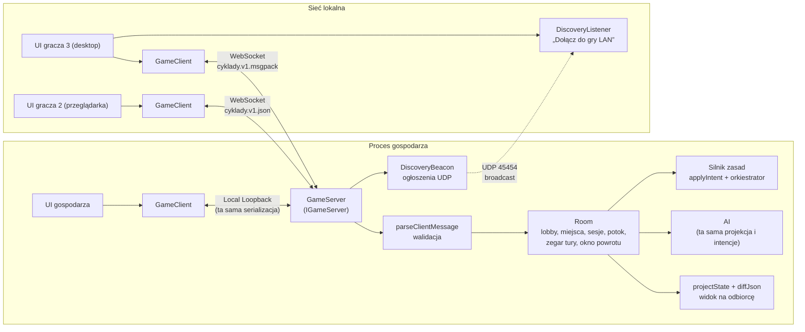

| Tryb | Tworzenie | Transporty | Kto gra |
|---|---|---|---|
| Single Player | `createSinglePlayerServer()` | tylko Local Loopback | człowiek + AI albo kilku ludzi (hotseat), każdy z własnym `connectLocal()` |
| LAN | `createLanServer({ port, discovery })` + `start()` | Local Loopback + WebSocket, ogłoszenia UDP | gospodarz lokalnie, pozostali przez sieć |

`IGameServer` ma sześć operacji: `createRoom`, `connectLocal`, `accept`
(połączenie z dowolnego transportu), `listRooms`, `start` i `stop`.
W trybie Single Player `start()` nie otwiera gniazda i zwraca `url: null`.
W trybie LAN otwiera nasłuch WebSocket, uruchamia ogłoszenia UDP i zwraca
adres serwera oraz `discoveryPort`.

Warstwy transportu:

| Warstwa | Rola | Implementacje |
|---|---|---|
| `RawChannel` | ramki tekstowe lub binarne | `createLoopbackPair` (pamięć), `WebSocketListener` / `connectWebSocket` |
| `MessageChannel` | kodek nałożony na kanał surowy | `withCodec(raw, JSON_CODEC \| MSGPACK_CODEC)` |
| `GameServer` / `GameClient` | protokół (wiadomości) | te same w obu trybach |

Loopback też koduje i dekoduje wiadomości (JSON albo MessagePack), więc tryb
Single Player przechodzi przez tę samą granicę serializacji co sieć.

## 3. Przepływ komendy

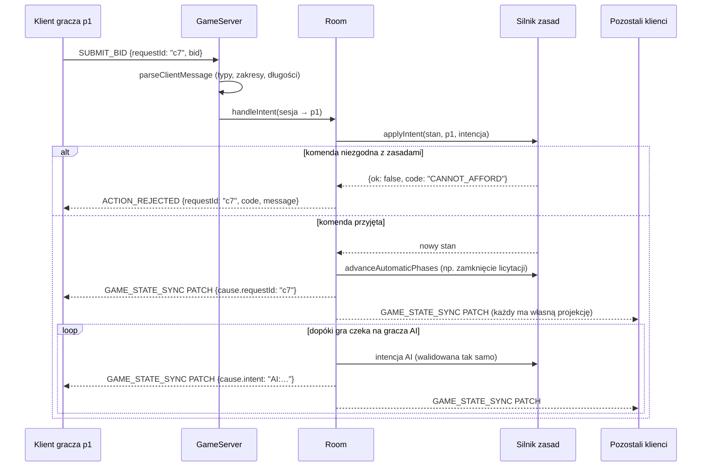

Komendy pokoju wykonują się synchronicznie w jednym obrocie pętli zdarzeń,
więc intencje graczy nie mogą się przeplatać. Nowy stan zostaje zapisany
dopiero po sukcesie silnika (czyste funkcje). Wyjątek w silniku kończy się
odpowiedzią `INTERNAL_ERROR`, a stan pozostaje nietknięty.

Klient traktuje każde żądanie jak obietnicę. Rozstrzyga ją
`GAME_STATE_SYNC` z `cause.requestId` tego żądania (dla `JOIN_ROOM`
i `LOBBY_ACTION`: `ROOM_STATE` z `inReplyTo`), a odrzuca `ACTION_REJECTED`
jako `ActionRejectedError` albo przekroczenie czasu.

## 4. Bitwa, rzuty i koniec gry

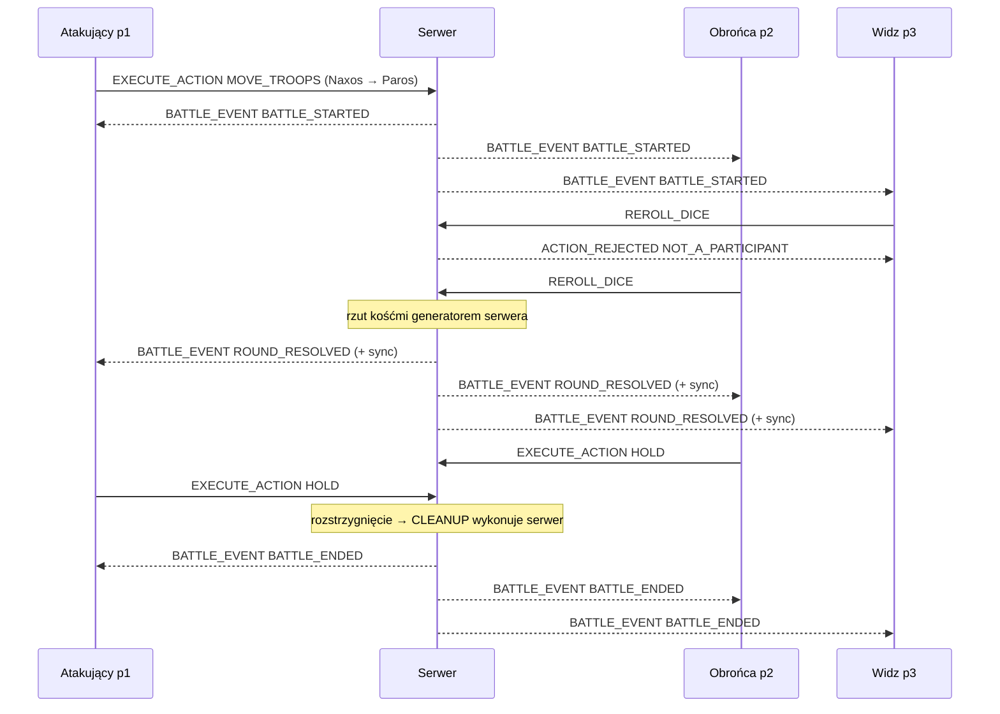

`REROLL_DICE` to prośba o rzut w kolejnej rundzie starcia. Może ją wysłać
każdy uczestnik bitwy, ale wynik rzutu zawsze wylicza serwer (generator
i raport rundy: sekcja 6.1). Pokój może też rzucać automatycznie
(`autoRollBattles`). Po osiągnięciu warunku zwycięstwa
serwer wysyła do wszystkich `GAME_OVER`, a pokój przechodzi w stan `FINISHED`
i odrzuca dalsze komendy (`GAME_FINISHED`).

## 5. Synchronizacja stanu i powrót po zerwaniu połączenia

- **FULL / PATCH.** Serwer pamięta ostatni widok wysłany każdemu klientowi
  i przesyła łatkę JSON Patch (RFC 6902: `add` / `replace` / `remove`).
  W prawdziwej partii łatki są ponad 10 razy mniejsze od pełnych stanów
  (test). Gdy łatka ma ponad 4 KB i przekracza połowę pełnego stanu, serwer
  wysyła pełny stan.
- **Rewizje.** Łatka niesie `baseRevision`. Gdy nie zgadza się z rewizją
  klienta (np. po zgubionej wiadomości), klient sam wysyła `REQUEST_SYNC`
  i dostaje pełny stan.
- **Żeton miejsca.** `ROOM_STATE` przekazuje właścicielowi miejsca
  `seatToken`. Po zerwaniu połączenia `JOIN_ROOM` z tym żetonem przywraca to
  samo miejsce i pełny stan, jeśli gracz zdąży w oknie powrotu (sekcja 6.4).
  Bez żetonu do trwającej partii wejść się nie da.

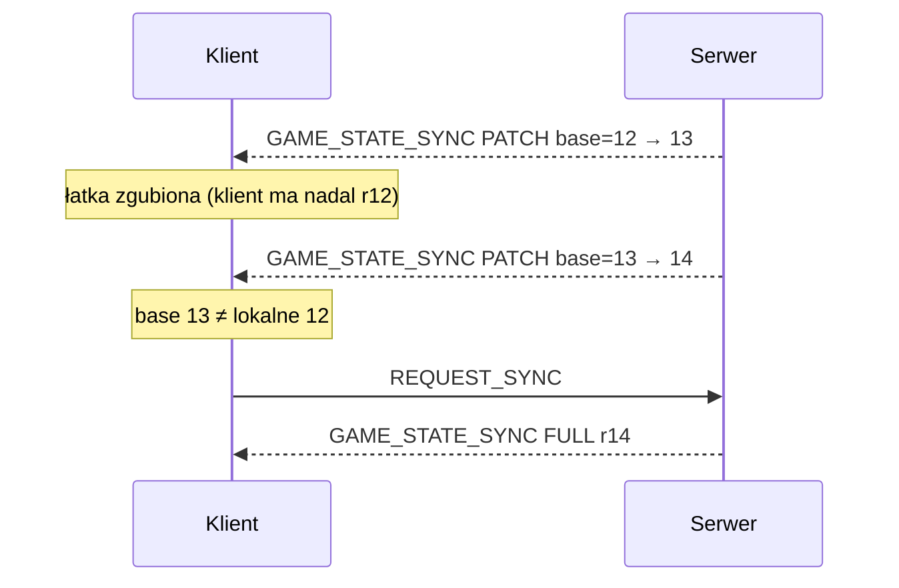

## 6. Zdarzenia losowe, zegar tury i powroty do gry

Kod: `src/model/rng.ts` (generator), `src/engine/combat.ts` (raport
starcia), `src/net/turnClock.ts` i `src/net/scheduler.ts` (zegar tury),
`src/net/room.ts` (limity czasu i okno powrotu), `src/net/websocket.ts`
(ping) oraz `src/net/reconnect.ts` (powrót po stronie klienta).

### 6.1 Rzuty kośćmi i raport starcia

- **Losuje tylko serwer, generatorem kryptograficznym.** Każda partia
  dostaje strumień ChaCha20 (RFC 8439) z 256-bitowym kluczem z systemowego
  źródła entropii (`createSecureRng`). Klucz leży w stanie gry na serwerze,
  ale projekcja nigdy go nie wysyła. Bez klucza nie da się przewidzieć
  kolejnych rzutów ani kolejności zakrytych talii, nawet znając wszystkie
  dotychczasowe rzuty. Z kluczem partię można odtworzyć co do bitu
  (powtórki, rozstrzyganie sporów).
- Pokój sam pilnuje generatora. Jeśli fabryka partii potasowała talie
  własnym, jawnym ziarnem, pokój i tak podmienia generator na swój przed
  pierwszym losowaniem w grze. Generator mulberry32 (32-bitowy stan, możliwy
  do odtworzenia z kilkunastu rzutów) służy już tylko testom silnika.
- **Rzut, a potem raport dla wszystkich naraz.** Na prośbę `REROLL_DICE`
  jednej ze stron (albo po upływie czasu) serwer losuje obie kości, liczy
  wyniki z modyfikatorami i rozsyła `BATTLE_EVENT` z `ROUND_RESOLVED` do
  wszystkich graczy w jednej pętli, zanim wyśle nowy stan. Obie strony
  dostają identyczny raport w tej samej chwili, więc żadna nie może
  zareagować wcześniej.
- **Brak przelosowania.** Druga prośba o rzut w tej samej rundzie jest
  odrzucana kodem `WRONG_STEP`. Chwila wysłania prośby nie wpływa na wynik,
  bo kolejne słowo strumienia wyznacza klucz.

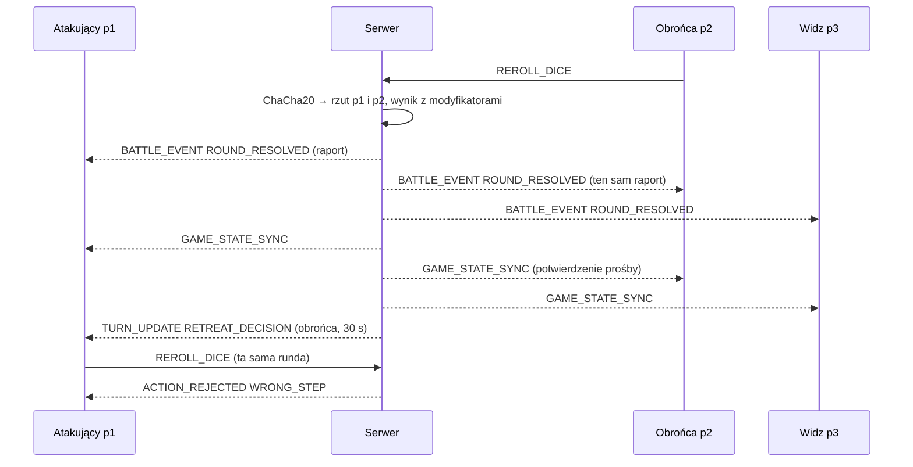

Raport rundy (skrócony):

```json
{
  "type": "BATTLE_EVENT", "battleId": "b1", "attacker": "p1", "defender": "p2",
  "location": { "kind": "LAND", "islandId": "paros" },
  "events": [{
    "type": "ROUND_RESOLVED",
    "round": {
      "round": 1,
      "attacker": {
        "score": { "roll": 3, "units": 2, "total": 7,
                   "modifiers": [{ "source": "HERO", "heroId": "herakles", "value": 2 }] },
        "casualty": null
      },
      "defender": {
        "score": { "roll": 1, "units": 2, "total": 6,
                   "modifiers": [{ "source": "HERO", "heroId": "achilles", "value": 2 },
                                 { "source": "FORTRESS", "islandId": "paros", "value": 1 }] },
        "casualty": { "kind": "UNIT" }
      }
    }
  }]
}
```

Wynik zawsze spełnia `roll + units + Σ modifiers.value = total`.

| `source` | Kiedy | Wartość |
|---|---|---|
| `FORTRESS` | obrona wyspy | +1 za każdą Fortecę |
| `PORT` | obrona pola morskiego | +1 za każdy Port na sąsiednich wyspach obrońcy |
| `METROPOLIS` | obrona wyspy albo morza | +1, liczy się jak Forteca albo Port (`countsAs`) |
| `HERO` | bitwa lądowa | siła herosa |
| `WAR_PORT` | obrona wyspy z Portem Wojennym | floty obrońcy z sąsiedniego pola |
| `FORTIFICATIONS_IGNORED` | atakujący ma Ulissesa | wartość ujemna: znosi Fortece i Metropolię |
| `CARD_BONUS` | efekty kart | stała premia strony |

### 6.2 Licytacja w czasie rzeczywistym

Silnik licytacji zwraca zdarzenia (ofiara, przebicie, Apollo), a serwer
rozsyła je wszystkim jako `BIDDING_EVENT`. Gdy gracz A przebije gracza B,
B w tym samym obrocie pętli serwera dostaje zdarzenie przebicia, nowy stan
i `TURN_UPDATE` z powodem `OUTBID`. Zanim ktokolwiek wyśle kolejną komendę,
B wie, kto go przebił, na którym bogu, za ile i ile ma czasu.

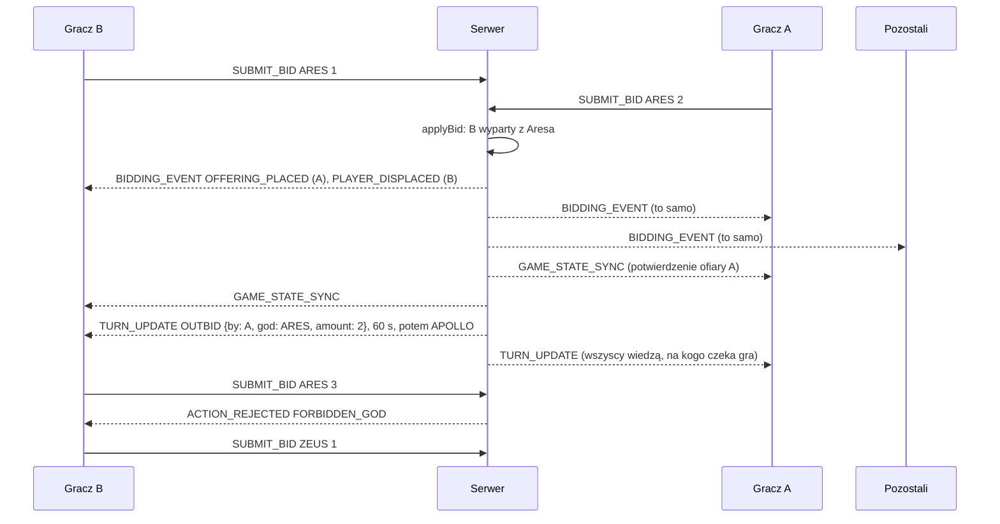

### 6.3 Zegar tury

| Faza | `details.reason` | Na kogo czeka gra | Limit w LAN | Ruch pasywny |
|---|---|---|---|---|
| BIDDING | `BID` | gracz z kolejki | 60 s | `APOLLO` |
| BIDDING | `OUTBID` | przebity gracz | 60 s, liczone od nowa | `APOLLO` |
| ACTIONS | `GOD_TURN` | gracz w turze boga | 180 s na całą turę | `END_TURN` |
| BATTLE_RESOLUTION | `BATTLE_ROLL` | obie strony bitwy | 30 s | `ROLL` |
| BATTLE_RESOLUTION | `RETREAT_DECISION` | strona, która decyduje | 30 s | `HOLD` (walka dalej) |

- `TURN_UPDATE` przychodzi do wszystkich przy każdej nowej decyzji i do
  gracza, który wraca do partii. Niesie `turnId`, `actors`, `details`,
  termin `deadline` (zegar serwera), `remainingMs` (odliczanie zegarem
  klienta, odporne na różnice zegarów) i zapowiedziany `passiveMove`.
- Kolejne akcje w tej samej turze boga nie przedłużają jej. Bitwa w trakcie
  tury boga zatrzymuje licznik, a po bitwie tura odlicza dalej od tego samego
  miejsca.
- Po upływie czasu serwer wykonuje ruch pasywny w imieniu gracza, tym samym
  potokiem co komendy graczy: walidacja w silniku, zdarzenia, rozesłanie
  stanu. Przyczyna ma postać `TIMEOUT:…` (np. `TIMEOUT:SUBMIT_BID`)
  w `GAME_STATE_SYNC.cause` i `BIDDING_EVENT.cause`.
- Limit obejmuje każdą turę, także bota: gdyby AI utknęło, gra i tak pójdzie
  dalej.
- Serwer LAN włącza `DEFAULT_TURN_TIMEOUTS`, jeśli pokój nie ustawił własnych
  `turnTimeouts`. W Single Player limitów nie ma (`deadline: null`).
- Czas pochodzi z interfejsu `Scheduler`: na serwerze to zegar systemowy,
  a w testach `ManualScheduler`, więc minutowe scenariusze trwają milisekundy.

### 6.4 Rozłączenie i powrót

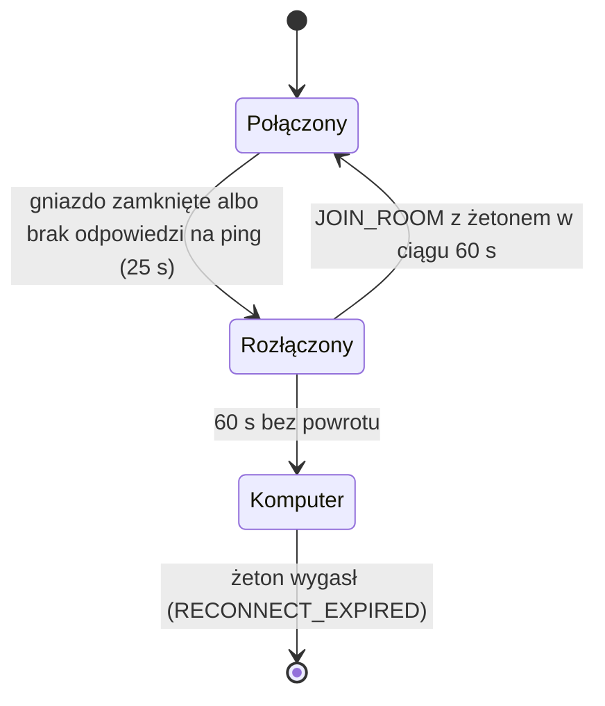

- **Wykrycie zerwania.** Serwer wysyła ping WebSocket co 10 s. Połączenie,
  z którego przez 25 s nie przyszły żadne dane (nawet pong), zostaje
  zerwane. Zanik Wi-Fi albo uśpiony laptop wykrywamy więc w sekundach,
  a nie po minutach, jak przy samym TCP keep-alive.
- **Okno powrotu (domyślnie 60 s, `reconnectGraceMs`).** Miejsce i cały stan
  gracza czekają na serwerze. Pozostali widzą w `ROOM_STATE` wartości
  `connected: false` i `reconnectDeadline`. Tury nieobecnego rozstrzyga w tym
  czasie zegar tury, np. w licytacji trafia on do Apolla.
- **Powrót.** `JOIN_ROOM` z `seatToken` daje `ROOM_STATE`, pełną migawkę
  `GAME_STATE_SYNC FULL` i `TURN_UPDATE` z bieżącą turą i pozostałym czasem.
  Stare połączenie z tym samym żetonem, np. półotwarte po awarii, serwer
  zamyka kodem 4000.
- **Po 60 s** miejsce przejmuje komputer (nazwa „Imię (AI)”) i od razu
  wykonuje zaległy ruch. Żeton wygasa, a próba powrotu kończy się kodem
  `RECONNECT_EXPIRED`.
- **Klient.** `client.reconnect(kanał)` wraca na miejsce i zachowuje
  subskrypcje interfejsu. `autoReconnect(client, () => connectWebSocket(url))`
  ponawia próby z rosnącą przerwą (0,5 s → 5 s) do 60 s. Nie wraca po kodzie
  1000 (gracz sam wyszedł) ani 4000 (miejsce przejęło nowsze połączenie), bo
  dwa klienty odbijałyby sobie wtedy miejsce bez końca.

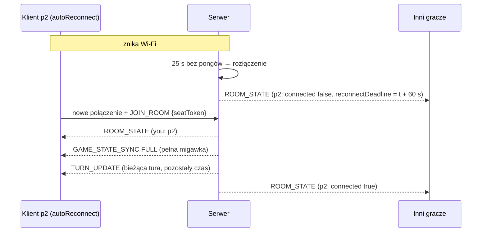

## 7. Lobby (Room Manager)

Przed startem partii pokój jest lobby. Sloty stoją w kolejności przy stole,
a każdy jest wolny, zajęty przez człowieka albo przez bota. Klient zmienia
lobby wiadomością `LOBBY_ACTION`. Nadawca dostaje `ROOM_STATE` z `inReplyTo`,
a pozostali gracze ten sam stan bez `inReplyTo`.

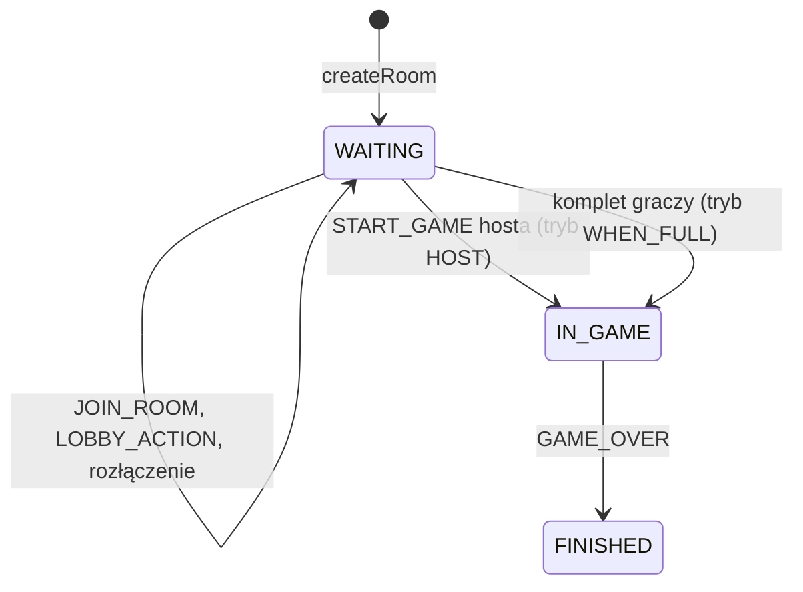

| `action.type` | Kto | Warunki (kod odrzucenia) | Gotowość |
|---|---|---|---|
| `SET_COLOR {color}` | każdy gracz | kolor wolny (`COLOR_TAKEN`) | kasuje własną |
| `SET_CITY {city \| null}` | każdy gracz | miasto z listy pokoju (`UNKNOWN_CITY`), niewybrane przez innego gracza (`CITY_TAKEN`); `null` oznacza przydział przy starcie | kasuje własną |
| `SET_READY {ready}` | każdy gracz | – | ustawia własną |
| `SET_EXPANSIONS {hades, monuments}` | host | tylko dodatki dostępne na serwerze (`EXPANSION_UNAVAILABLE`) | kasuje wszystkim |
| `ADD_BOT {slot}` | host | slot istnieje (`INVALID_SLOT`) i jest wolny (`SLOT_OCCUPIED`) | kasuje wszystkim |
| `REMOVE_BOT {slot}` | host | w slocie jest bot (`NOT_A_BOT`) | kasuje wszystkim |
| `START_GAME` | host | co najmniej `minPlayers` zajętych slotów (`NOT_ENOUGH_PLAYERS`), wszyscy goście gotowi (`NOT_ALL_READY`) | – |

Akcja hosta wysłana przez innego gracza kończy się kodem `NOT_HOST`, a każda
akcja lobby po starcie partii kodem `GAME_ALREADY_STARTED`.

- **Host** to najwcześniej przybyły człowiek w pokoju. Przy polityce
  `LOCAL_ONLY` (lobby LAN z `archipelagoLobby`) hostem może być tylko
  połączenie w procesie serwera (Local Loopback), więc gość z sieci nie
  przejmie pokoju, nawet jeśli dołączy pierwszy. Przy `FIRST_HUMAN`
  uprawnienia przechodzą na kolejnego gracza, gdy host wyjdzie.
- **Gotowość.** Boty są zawsze gotowe, a host nie zgłasza gotowości, bo start
  jest jego decyzją. Zmiana ustawień wspólnych (dodatki, skład przy stole)
  kasuje gotowość wszystkich, więc nikt nie zaczyna partii na warunkach,
  których nie widział.
- **Wyjście przed startem** zwalnia slot, kolor i miasto. W trakcie partii
  miejsce czeka na powrót z żetonem.
- **Tryb startu.** `HOST` (lobby LAN): start na polecenie hosta. `WHEN_FULL`
  (domyślny, np. Single Player): partia zaczyna się sama, gdy zajęte są
  wszystkie sloty, także wtedy, gdy ostatni zajmie bot.
- **Wynik lobby.** `createGame(names, setup)` dostaje `GameSetup`: ziarno,
  dodatki oraz graczy z kolorami, miastami i rodzajem (człowiek albo bot).
  Gracze bez wybranego miasta dostają wolne miasta w kolejności listy.
  W partii bez Hadesa nie ma kolumny Hadesa ani herosów w talii, a bez
  Monumentów nie ma puli Monumentów.

`ROOM_STATE.settings` daje interfejsowi wszystko, czego potrzebuje ekran
lobby: nazwę pokoju, tryb startu, najmniejszą i największą liczbę graczy,
dodatki włączone i dostępne, miasta i kolory. `seats[]` opisuje sloty
(`kind: HUMAN | AI | EMPTY`, nazwa, kolor, miasto, gotowość, połączenie),
a `host` wskazuje gracza z uprawnieniami hosta.

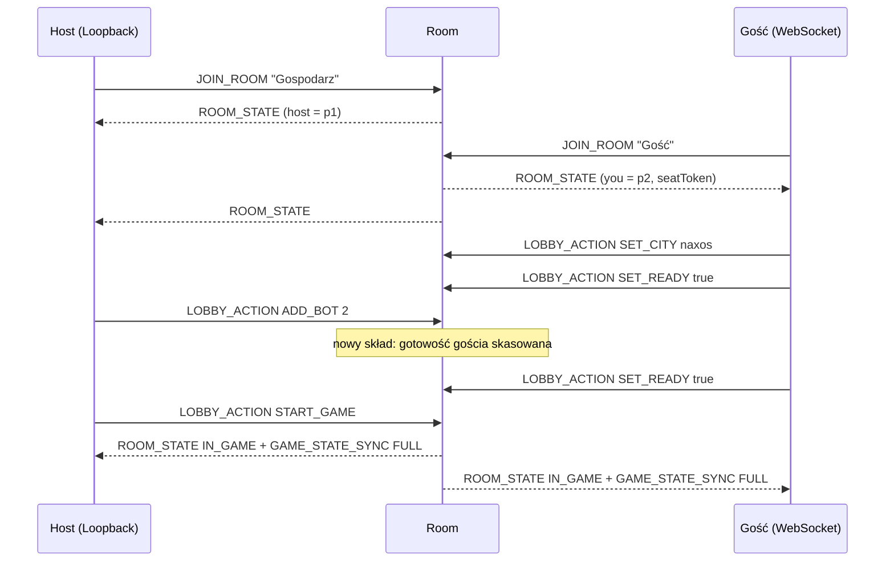

## 8. Wykrywanie serwerów w LAN (UDP) i łączenie ręczne

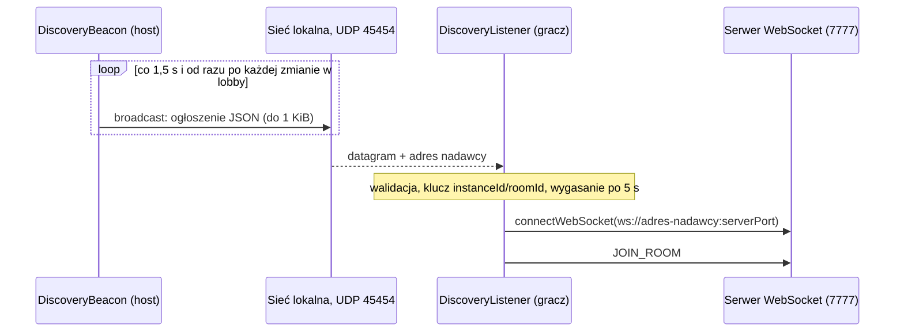

Ogłoszenie to jeden datagram z obiektem JSON:

| Pole z wymagań | Pole w pakiecie | Wartość |
|---|---|---|
| – | `magic`, `v` | `"CYKLADY-LAN"` i `1` (obce pakiety są pomijane) |
| – | `instanceId` | losowy identyfikator uruchomienia serwera: odróżnia serwery i scala kopie z kilku interfejsów |
| HostName | `hostName` | nazwa gracza-hosta, a bez niego nazwa komputera |
| – | `roomId`, `roomName`, `status` | pokój i jego stan (`WAITING`, `IN_GAME`, `FINISHED`) |
| PlayerCount | `playerCount` | zajęte sloty (ludzie i boty) |
| MaxPlayers | `maxPlayers` | liczba slotów |
| ModulesActive | `modulesActive` | `BASE` oraz `HADES` / `MONUMENTS` według przełączników lobby |
| ServerPort | `serverPort` | port WebSocket serwera gry |

```json
{"magic":"CYKLADY-LAN","v":1,"instanceId":"5b0c…","hostName":"Gospodarz","roomId":"archipelag","roomName":"Archipelag","status":"WAITING","playerCount":2,"maxPlayers":5,"modulesActive":["BASE","HADES","MONUMENTS"],"serverPort":7777}
```

- **Nadawca.** `createLanServer({ port, discovery })` uruchamia
  `DiscoveryBeacon` razem z serwerem WebSocket, a `discovery: false` wyłącza
  ogłoszenia. Pakiety idą na adres rozgłoszeniowy każdej podsieci
  (np. 192.168.1.255) i na 255.255.255.255, co 1,5 s oraz od razu po każdej
  zmianie w lobby (dołączenie, dodatki, bot, start). Opcje: `port`
  (domyślnie 45454), `intervalMs`, `targets` i `hostName`.
- **Adres serwera** klient bierze z nagłówka datagramu (adres nadawcy),
  a nie z treści, więc host nie musi znać własnego IP w sieci.
- **Nasłuch.** `DiscoveryListener` słucha z `reuseAddr`, więc kilka gier na
  jednym komputerze może szukać serwerów naraz. Każdy pakiet przechodzi
  walidację, kopie są scalane, a pokój bez ogłoszenia przez 5 s znika
  z listy. `rooms()` zwraca aktualną listę, a `onChange` powiadamia tylko
  o zmianach: nowy pokój, liczba graczy, status, dodatki albo zniknięcie.
- **Łączenie ręczne (awaryjne)** działa, gdy broadcast jest blokowany (sieć
  dla gości, izolacja klientów Wi-Fi, VPN). Gracz wpisuje adres,
  a `connectManually("192.168.1.20:7777")` łączy się z serwerem. Parser
  przyjmuje `IP`, `IP:port`, `nazwa.local:port`, `ws://…` i IPv6
  w nawiasach (`[fe80::1]:7777`). Domyślny port to 7777. Błędny adres albo
  brak odpowiedzi w ciągu 5 s kończy się komunikatem dla gracza.
- **Zapora systemowa** hosta musi przepuszczać przychodzący TCP na porcie gry
  (7777), a u graczy przychodzący UDP 45454.

```bash
npm run serve:lan                          # gospodarz: lobby Archipelagu (bot 2, hades off, start…)
npm run browse:lan                         # gracz: lista gier w sieci lokalnej
npm run browse:lan -- 192.168.1.20:7777    # gracz: łączenie ręczne
```

## 9. Katalog wiadomości (protokół v1)

Każda wiadomość ma pola `v: 1` i `type`. Wiadomości klienta mają też
`requestId` (do 64 znaków).

**Klient → Serwer**

| Typ | Pola | Odpowiedź serwera |
|---|---|---|
| `JOIN_ROOM` | `roomId`, `playerName` (≤ 32), `seatToken?` | `ROOM_STATE` (`inReplyTo`) + `GAME_STATE_SYNC` FULL po starcie |
| `LOBBY_ACTION` | `action`: `SET_COLOR`, `SET_CITY`, `SET_READY`, `SET_EXPANSIONS`, `ADD_BOT`, `REMOVE_BOT`, `START_GAME` (sekcja 7) | `ROOM_STATE` (`inReplyTo`) albo `ACTION_REJECTED` |
| `SUBMIT_BID` | `bid: {kind: "GOD", god, amount} \| {kind: "APOLLO"}` (intencja BID_GOD) | sync albo `ACTION_REJECTED` |
| `EXECUTE_ACTION` | `action`: `MOVE_FLEET`, `MOVE_TROOPS`, `RECRUIT_UNDEAD`, `BUILD_NECROPOLIS`, `BUY_CREATURE`, `RETREAT`, `HOLD` | sync (+ `BATTLE_EVENT`) albo odrzucenie |
| `END_TURN` | – | sync albo odrzucenie |
| `REROLL_DICE` | – | `BATTLE_EVENT` + sync albo odrzucenie |
| `REQUEST_SYNC` | – | `GAME_STATE_SYNC` FULL |

**Serwer → Klient**

| Typ | Pola | Kiedy |
|---|---|---|
| `ROOM_STATE` | `status`, `settings`, `host`, `seats[]` (z `connected` i `reconnectDeadline`), `you`, `seatToken` (tylko właścicielowi), `inReplyTo` | dołączenie, zmiana w lobby, rozłączenie i powrót, przejęcie miejsca przez komputer, start i koniec partii |
| `GAME_STATE_SYNC` | `mode: FULL \| PATCH`, `revision`, `baseRevision`, `state` / `ops`, `cause` | każda zmiana stanu |
| `ACTION_REJECTED` | `requestId`, `code`, `message` (PL), `details` | odrzucona komenda |
| `BATTLE_EVENT` | `battleId`, `attacker`, `defender`, `location`, `events[]` (`BATTLE_STARTED`, `ROUND_RESOLVED` z raportem rundy, `RETREATED`, `BATTLE_DECIDED`, `BATTLE_ENDED`…) | przebieg bitwy, do wszystkich naraz |
| `BIDDING_EVENT` | `cause`, `events[]` (`OFFERING_PLACED`, `PLAYER_DISPLACED`, `APOLLO_JOINED`, `BIDDING_STABLE`) | każda ofiara, także ruch serwera po upływie czasu |
| `TURN_UPDATE` | `turnId`, `actors`, `details` (`BID`, `OUTBID`, `GOD_TURN`, `BATTLE_ROLL`, `RETREAT_DECISION`), `deadline`, `remainingMs`, `passiveMove` | nowa decyzja, na którą czeka gra, i powrót gracza |
| `GAME_OVER` | `winners[]`, `finalCycle` | koniec partii |

Kody odrzuceń pochodzą z silnika zasad (np. `NOT_YOUR_TURN`,
`CANNOT_AFFORD`, `NO_FLEET_BRIDGE`, `LAST_ISLAND_PROTECTED`), z warstwy
sieciowej (`MALFORMED`, `UNKNOWN_ROOM`, `ROOM_FULL`, `INVALID_SEAT_TOKEN`,
`NOT_IN_ROOM`, `GAME_NOT_STARTED`, `GAME_FINISHED`, `UNSUPPORTED_ACTION`,
`NOT_IN_BATTLE`, `NOT_A_PARTICIPANT`, `INTERNAL_ERROR`) albo z lobby
(`NOT_HOST`, `GAME_ALREADY_STARTED`, `COLOR_TAKEN`, `UNKNOWN_CITY`,
`CITY_TAKEN`, `INVALID_SLOT`, `SLOT_OCCUPIED`, `NOT_A_BOT`,
`NOT_ALL_READY`, `NOT_ENOUGH_PLAYERS`, `EXPANSION_UNAVAILABLE`). Powrót po
upływie okna kończy się kodem `RECONNECT_EXPIRED`.

Kodowanie: JSON (ramki tekstowe) albo MessagePack (ramki binarne, mniejsze).
W LAN klient wybiera kodek podprotokołem WebSocket `cyklady.v1.json` albo
`cyklady.v1.msgpack`. Numer wersji w podprotokole i w polu `v` pozwala
w przyszłości obsługiwać kilka wersji protokołu naraz.

## 10. Bezpieczeństwo i odporność

| Zagrożenie | Obrona |
|---|---|
| Podszywanie się pod innego gracza | brak `playerId` w wiadomościach; gracz wynika z sesji, a nadmiarowe pola są usuwane |
| Oszukiwanie zasad | każda intencja przechodzi przez walidację silnika, a klient nie ma żadnej władzy nad stanem |
| Przewidywanie rzutów i zakrytych talii | ChaCha20 z 256-bitowym kluczem z CSPRNG; klucz nigdy nie opuszcza serwera, a jawne ziarna (np. `gameId`) nie mają wpływu na losowanie w grze |
| Przelosowanie albo wybór chwili rzutu | jeden rzut na rundę (druga prośba: `WRONG_STEP`); kolejne słowo strumienia wyznacza klucz, a nie chwila prośby |
| Blokowanie stołu (gracz nie gra albo zniknął) | limit czasu każdej decyzji i ruch pasywny, ping co 10 s, okno powrotu 60 s, potem komputer |
| Podglądanie ukrytych informacji | projekcja na odbiorcę (talie, złoto, karty Monumentów) |
| Uszkodzone lub złośliwe dane | walidator (typy, zakresy, długości list i napisów), dekoder MessagePack z limitami, ochrona przed `__proto__` |
| Ataki na protokół WebSocket | obowiązkowe maskowanie ramek klienta (1002), brak rozszerzeń (1002), limit 64 KiB (1009), poprawny UTF-8 (1007) |
| Zerwane połączenia | ping WebSocket co 10 s (zerwanie po 25 s ciszy), zwolnienie miejsca przed startem, a w trakcie partii 60 s na powrót z żetonem |
| Przejęcie lobby przez gościa | dodatki, boty i start tylko dla hosta; w lobby LAN hostem jest wyłącznie gracz w procesie serwera (`LOCAL_ONLY`) |
| Uszkodzone lub zalewające ogłoszenia UDP | ścisła walidacja pól, pakiet do 1 KiB, najwyżej 64 zapamiętane pokoje, wygasanie po 5 s |

Transport LAN nie jest szyfrowany (`ws://`), a ogłoszenia UDP nie są
uwierzytelnione. W zaufanej sieci lokalnej to wystarcza. Fałszywe ogłoszenie
może najwyżej dodać do listy pokój innego serwera, a gra i tak przechodzi
przez serwer autorytatywny. Do gry przez Internet trzeba użyć `wss://` (TLS,
np. przez odwrotne proxy) i dodać uwierzytelnianie.

## 11. Weryfikacja

- Testy kontraktów: oba kodeki przenoszą wszystkie wiadomości i pełny stan bez
  strat, łatki odtwarzają kolejne widoki prawdziwej partii, a walidator
  odrzuca błędne wiadomości.
- Testy end-to-end przez Local Loopback: Single Player z AI, hotseat, bitwa
  z `REROLL_DICE`, koniec gry, powrót z żetonem, ponowna synchronizacja po
  zgubionej łatce.
- Testy LAN na prawdziwych gniazdach: gospodarz przez Loopback, goście przez
  standardowego klienta WebSocket (JSON i MessagePack), odpowiedź 426 dla
  zwykłego HTTP oraz naruszenia protokołu zamykane kodami 1002, 1009 i 1007.
- Testy lobby (15): host i jego polityki, kolory, miasta, gotowość, dodatki
  (także niedostępne na serwerze), boty, warunki startu, partia utworzona
  z ustawień lobby, lobby zamknięte po starcie i granice konfiguracji pokoju.
- Testy wykrywania (12) na prawdziwych gniazdach UDP, ale tylko na
  127.0.0.1, bez broadcastu do sieci: format ogłoszenia, natychmiastowe
  aktualizacje, podtrzymanie i wygasanie pokoi, limit pokoi, zajęty port,
  łączenie ręczne i pełny przepływ od ogłoszenia do startu partii.
- Test mutacyjny: celowo zepsułem 16 mechanizmów protokołu (m.in.
  podszywanie się, wycieki informacji ukrytych, walidację, ramki WebSocket
  i ponowną synchronizację) oraz 58 mechanizmów lobby i wykrywania (m.in.
  uprawnienia hosta, gotowość, format ogłoszeń, wygasanie i łączenie
  ręczne). Testy wykryły każdą zmianę.
- Testy generatora (7): wektory RFC 8439, zgodność strumienia z OpenSSL,
  równomierność kości, brak przechyłu modulo, nowy klucz dla każdej partii.
- Testy synchronizacji walki (5): identyczny raport rundy w tej samej chwili
  u obu stron i widza, rzuty zgodne z kluczem pokoju, brak klucza
  w jakiejkolwiek wiadomości, jeden rzut mimo dwóch próśb, zgodność stanu
  po bitwie, ruchy pasywne w bitwie.
- Testy licytacji i zegara tury (9): powiadomienie o przebiciu, Apollo po
  limicie, kasowanie licznika po ruchu, koniec tury boga, pauza na bitwę,
  zawieszony bot, pokój bez limitów, domyślne limity w LAN.
- Testy rozłączeń (8): okno powrotu, powrót z pełną migawką, tura
  nieobecnego, przejęcie przez komputer, podwójne połączenie z jednym
  żetonem, a w LAN wykrycie zamilkłego klienta pingiem i automatyczny powrót
  po zerwaniu gniazda.
- Test mutacyjny: 41 celowych usterek w generatorze, raporcie starcia,
  zegarze tury, oknie powrotu, pingu i automatycznym powrocie. Testy
  wykryły każdą z nich.
- Próby dymne przykładów: `serve:lan` i dwa `browse:lan` przechodzą przez
  lobby do startu partii, licytacja z przebiciem pokazuje odliczanie,
  a gracz połączony przez pośrednika TCP po zerwaniu sam wraca do partii.

## 12. Dalsze kroki

- Obsługa zakupu stworów w silniku (`BUY_CREATURE` jest dziś odrzucane jako `UNSUPPORTED_ACTION`).
- Sprawdzalne rzuty: skrót klucza ChaCha20 ogłaszany na starcie, a klucz po końcu partii, żeby gracze mogli odtworzyć każdy rzut.
- Zapis partii (klucz i dziennik intencji) do powtórek.
- Limit liczby wiadomości na sekundę na połączenie.
- Tryb obserwatora (połączenie bez miejsca, projekcja `viewer: null`).
- Wybór mapy w lobby. Dziś mapa i lista miast są częścią konfiguracji pokoju.
- Ogłoszenia w sieciach IPv6 (multicast). Dzisiejszy beacon działa tylko w IPv4.
