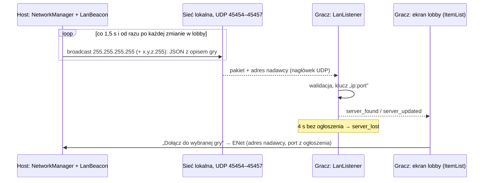
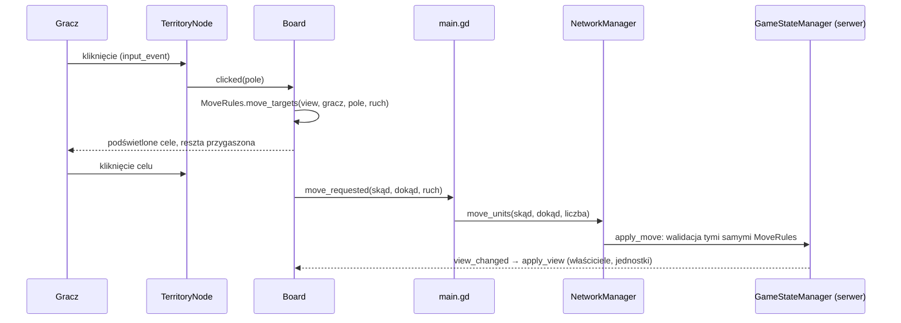
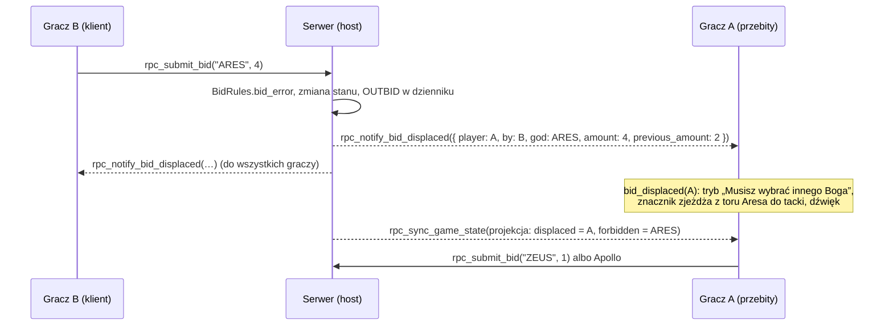
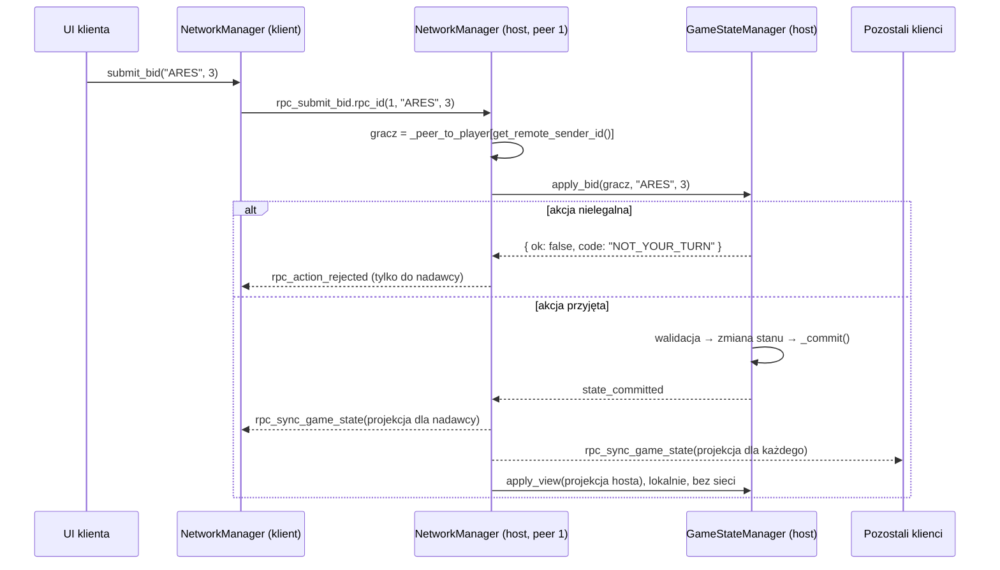

# Cyklady w Godot 4: sieć, wykrywanie gier LAN, plansza, licytacja i stan gry

Warstwa sieciowa i stan gry dla cyfrowej wersji Cyklad na wbudowanym
High-Level Multiplayer API (`ENetMultiplayerPeer`). Całość sprawdzona na Godot 4.7.1.

- Gospodarz (host) jest serwerem autorytatywnym.
- Gry w sieci lokalnej ogłaszają się pakietami UDP broadcast (`PacketPeerUDP`), a gracze widzą je na liście w lobby.
- Tryb Single Player uruchamia ten sam serwer na loopbacku z graczami AI.
- Plansza „Archipelag” podświetla wyłącznie prawidłowe ruchy. Liczy je tymi samymi regułami, którymi serwer sprawdza ruch.
- Panel licytacji pokazuje tory ofiar bogów i kolejkę Apolla. Ofiarę sprawdza przed wysłaniem (kapłani, złoto), a na przebicie reaguje od razu.

```text
godot/
├── project.godot                 autoloady i scena główna są już skonfigurowane
├── scripts/
│   ├── autoload/
│   │   ├── GameData.gd           baza treści: bogowie, stwory i herosi, Monumenty (same dane)
│   │   ├── GameStateManager.gd   stan partii i reguły (decyduje tylko serwer)
│   │   └── NetworkManager.gd     ENet, RPC, lobby, żetony powrotu, rozłączenia, ogłoszenia hosta
│   ├── core/
│   │   ├── ArchipelagoMap.gd     mapa: wyspy, pola morskie, sąsiedztwo, miasta startowe
│   │   ├── MoveRules.gd          reguły ruchu i budowy wspólne dla serwera i planszy
│   │   ├── BidRules.gd           reguły licytacji wspólne dla serwera i panelu licytacji
│   │   ├── RecruitRules.gd       rekrutacja: koszty, limity, miejsca nowych jednostek
│   │   └── CreatureRules.gd      tor stworów: ceny ze zniżką, cele mocy, akcja Zeusa
│   ├── network/
│   │   ├── LanBeacon.gd          nadajnik: ogłoszenie gry co 1,5 s (UDP broadcast)
│   │   └── LanListener.gd        odbiornik: lista gier, server_found / server_updated / server_lost
│   ├── ui/
│   │   ├── board.gd              plansza: pola, wybór, highlight_valid_moves(), rozkazy
│   │   ├── TerritoryNode.gd      pole planszy (Area2D): stan, wygląd, najechanie, kliknięcie
│   │   ├── BiddingBoardUI.gd     panel licytacji: tryby, walidacja przed RPC, przebicie (animacja, dźwięk)
│   │   ├── OfferingTrack.gd      tor ofiar jednego boga (pola 1–10 i „10+”)
│   │   ├── ActionPanelUI.gd      panel akcji w turze boga: rekrutacja i budowa (rozdział 10)
│   │   ├── CreatureTrackUI.gd    tor stworów: ceny, zakup z celem mocy, akcja Zeusa
│   │   ├── MetropolisDialogUI.gd okno wyboru wyspy dla Metropolii
│   │   └── GameOverPanelUI.gd    okno końca gry: zwycięzca, przewaga złota, remis
│   └── ai/                       na razie puste: miejsce na wydzieloną AI (TASKS.md, rozdział 4)
├── scenes/
│   ├── Main.tscn, main.gd        scena główna: lista gier LAN, poczekalnia, panel partii, dziennik
│   ├── LanLobby.tscn, lan_lobby.gd  ekran „Gry w sieci lokalnej” (ItemList + przyciski)
│   ├── board/Board.tscn          scena planszy (skrypt scripts/ui/board.gd)
│   ├── ui/BiddingBoard.tscn      panel licytacji: tory bogów, Apollo, kwota, tacka, dźwięk
│   ├── ui/ActionPanel.tscn, CreatureTrack.tscn, MetropolisDialog.tscn, GameOverPanel.tscn  sceny paneli tur bogów
│   └── main_menu/, lobby/        na razie puste: docelowe miejsca scen menu i poczekalni
├── assets/
│   ├── shaders/territory.gdshader  wypełnienie pola: kolor właściciela, podświetlenie, pulsowanie
│   └── textures/, audio/, fonts/ na razie puste
├── resources/                    na razie puste: zasoby kart i Monumentów
├── tools/
│   └── build_board.gd            generator scenes/board/Board.tscn z ArchipelagoMap (uruchamiany raz)
└── tests/
    ├── RunTests.tscn             testy bez okna (reguły, ENet, UDP, UI)
    └── run_tests.gd
```

## 1. Podłączenie w Scene Tree

### Krok 1: autoloady (singletony)

*Project → Project Settings → Globals → Autoload*, w tej kolejności:

| Kolejność | Ścieżka | Nazwa | Global Variable |
|---|---|---|---|
| 1 | `res://scripts/autoload/GameData.gd` | `GameData` | włączone |
| 2 | `res://scripts/autoload/GameStateManager.gd` | `GameStateManager` | włączone |
| 3 | `res://scripts/autoload/NetworkManager.gd` | `NetworkManager` | włączone |

W `project.godot` z repozytorium wszystkie trzy autoloady są już wpisane.

- **Kolejność ma znaczenie.** `NetworkManager` w `_ready()` szuka węzła
  `GameStateManager` obok siebie i łączy się z jego sygnałami. `GameData`
  to same dane (stałe i funkcje statyczne), więc stoi pierwszy.
- **Dlaczego autoloady.** RPC w Godot trafiają do węzła o tej samej ścieżce na
  każdym komputerze. Autoload ma zawsze ścieżkę `/root/NetworkManager`, więc
  zmiana sceny (menu → plansza) nie psuje komunikacji.
- **Nadajnik i odbiornik to zwykłe węzły.** `LanBeacon` i `LanListener` mają
  `class_name`, więc są też w oknie *Add Node*. Nadajnik tworzy sam
  `NetworkManager`, gdy gracz zakłada grę LAN. Odbiornik jest węzłem
  ekranu lobby i działa tylko wtedy, gdy ten ekran jest widoczny.

### Krok 2: drzewo w czasie gry

```text
/root
├── GameData                  autoload: baza treści (bogowie, stwory, Monumenty), tylko do odczytu
├── GameStateManager          autoload: na serwerze pełny stan, wszędzie `view` (projekcja dla gracza)
├── NetworkManager            autoload: serwer / klient ENet, RPC, miejsca, żetony, rozłączenia
│   └── LanBeacon             tworzony przez host_game(), usuwany przez leave_game()
└── Main (Control)            scena główna (main.gd)
    ├── Margin / Layout (VBoxContainer)
    │   ├── %Browser          instancja LanLobby.tscn (lan_lobby.gd)
    │   │   ├── LanListener   odbiornik ogłoszeń
    │   │   ├── %NameEdit     imię gracza
    │   │   ├── %ServerList   ItemList: gry w sieci lokalnej
    │   │   ├── %SearchLabel  „Szukam gier…”, gdy lista jest pusta
    │   │   ├── %JoinButton   „Dołącz do wybranej gry”
    │   │   ├── CreateRow     %ServerNameEdit, %HadesCheck, %MonumentsCheck, %CreateButton („Stwórz Grę LAN”)
    │   │   ├── DirectRow     %AddressEdit, %DirectButton („Połącz przez IP”)
    │   │   ├── %SingleButton „Gra solo z AI”
    │   │   └── %StatusLabel  komunikaty (łączenie, błędy)
    │   ├── %WaitingRoom      poczekalnia: %WaitingLabel, %AddAiButton, %StartButton (host), %WaitingLeaveButton
    │   ├── %Game             HBoxContainer: mapa po lewej, panel po prawej
    │   │   ├── %MapView      SubViewportContainer → MapViewport (SubViewport) → %Board (Board.tscn)
    │   │   └── SideScroll    ScrollContainer → Side: %StatusLabel, %HintLabel, %BiddingBoard (w licytacji),
    │   │                     %ActionPanel (w turach bogów), %CreatureTrack (w licytacji i turach bogów),
    │   │                     %MoveRow (FromEdit, ToEdit, CountSpin, MoveButton), EndTurnButton, LeaveButton
    │   └── %Log              RichTextLabel (dziennik, raporty bitew)
    ├── %MetropolisDialog     okno nad całą sceną: wybór wyspy dla Metropolii (tylko gracz, na którego czeka serwer)
    └── %GameOverPanel        okno nad całą sceną w fazie GAME_OVER
```

- **`%`**: węzeł ma włączone *Access as Unique Name*, więc skrypt jego sceny sięga do niego przez `%Nazwa` niezależnie od zagnieżdżenia.
- **Ekran lobby to osobna scena.** Można go wstawić do dowolnego menu. Swoje węzły obsługuje kontroler `lan_lobby.gd`.
- **Przełączanie ekranów.** Robi je `main.gd` na sygnały:
  - `server_started` albo `connection_succeeded` → poczekalnia;
  - `view_changed` → panel partii;
  - wyjście albo błąd połączenia → lista gier.

### Krok 3: sygnały

Sygnały autoloadów podłącza się w kodzie. Panel *Node → Signals* w edytorze
nie widzi autoloadów, bo nie należą do edytowanej sceny.

```gdscript
# lan_lobby.gd: odbiornik ogłoszeń → lista gier, przyciski → NetworkManager
func _ready() -> void:
	$LanListener.server_found.connect(_on_servers_changed)
	$LanListener.server_updated.connect(_on_servers_changed)
	$LanListener.server_lost.connect(_on_servers_changed)
	%JoinButton.pressed.connect(_on_join_pressed)        # NetworkManager.join_game(adres nadawcy, port z ogłoszenia, imię)
	%CreateButton.pressed.connect(_on_create_pressed)    # NetworkManager.host_game(imię, port, { server_name, hades, monuments })
	%DirectButton.pressed.connect(_on_direct_pressed)    # Network.parse_address(tekst) → join_game(host, port, imię)

# main.gd: sieć i stan gry → ekrany
func _ready() -> void:
	NetworkManager.server_started.connect(_on_server_started)            # → poczekalnia
	NetworkManager.connection_succeeded.connect(_on_connection_succeeded)  # → poczekalnia
	NetworkManager.connection_failed.connect(_on_connection_failed)      # (code, message) → lista gier
	NetworkManager.server_disconnected.connect(_on_server_disconnected)
	NetworkManager.lobby_changed.connect(_on_lobby_changed)              # (players, settings)
	NetworkManager.action_rejected.connect(_on_action_rejected)          # (code, message)
	GameStateManager.view_changed.connect(_on_view_changed)              # projekcja dla tego gracza → panel partii
	GameStateManager.battle_reported.connect(_on_battle_reported)        # raport bitwy
	# Plansza (%Board) sama rysuje GameStateManager.view. Jej sygnały to rozkazy dla serwera:
	_board.move_requested.connect(_on_board_move)                        # (from_id, to_id, action_type) → NetworkManager.move_units
	_board.build_requested.connect(NetworkManager.build)                 # (island_id)
	_board.selection_changed.connect(_on_board_selection)                # pole „skąd” i licznik jednostek
	_board.hint_changed.connect(func(text: String) -> void: _hint.text = text)
	# Panel licytacji (%BiddingBoard) sam słucha GameStateManager (view_changed, bid_displaced).
	_bidding.offer_confirmed.connect(NetworkManager.submit_bid)          # poprawna ofiara → serwer
	NetworkManager.action_rejected.connect(_on_action_rejected)          # … → _bidding.on_action_rejected(code, message)
```

Pełne, działające przykłady są w `scenes/lan_lobby.gd` i `scenes/main.gd`.
Zasada jest jedna: UI rysuje wyłącznie `GameStateManager.view` i nigdy samo
nie zmienia stanu gry.

## 2. Wykrywanie gier w sieci lokalnej (LAN Discovery)



Pakiet (JSON w jednym datagramie, do 1 KiB):

| Pole | Znaczenie |
|---|---|
| `game`, `v` | `"cyklady"` i `1`. Obce pakiety są pomijane. |
| `server_name` | nazwa gry z pola „Nazwa gry” (domyślnie „Gra: imię hosta”), najwyżej 64 znaki |
| `port` | port ENet serwera gry (domyślnie 8910) |
| `current_players`, `max_players` | zajęte miejsca (ludzie i AI) oraz limit (5) |
| `has_hades`, `has_monuments` | dodatki wybrane przy tworzeniu gry (`set_expansions` w lobby) |
| `in_game` | partia trwa. Na liście taka gra jest nieaktywna, bo nowy gracz i tak by nie wszedł. |

- **Adres serwera bierzemy z nagłówka UDP**, a nie z treści pakietu, więc host nie musi znać własnego IP.
- **Zakres portów 45454–45457.** `PacketPeerUDP` nie pozwala dwóm programom
  słuchać na jednym porcie. Nadajnik wysyła więc każde ogłoszenie na cały
  zakres, a odbiornik zajmuje pierwszy wolny port. Dzięki temu kilka
  instancji gry na jednym komputerze (np. *Run Multiple Instances* w
  edytorze) widzi listę jednocześnie. Gdy wszystkie porty są zajęte, ekran
  lobby proponuje „Połącz przez IP”.
- **Adresy docelowe.** Oprócz `255.255.255.255` nadajnik wysyła na
  `x.y.z.255` prywatnych adresów IPv4 komputera, zakładając typową sieć
  domową /24. Ogólny broadcast na macOS i Windows wychodzi zwykle tylko
  domyślnym interfejsem. Ustawienie `discovery_subnet_broadcasts = false` to
  wyłącza.
- **Ogłoszenia natychmiastowe.** Dołączenie, wyjście, dodanie AI, zmiana
  dodatków i start partii wysyłają ogłoszenie od razu, bez czekania na takt.
  Wyjście z gry zatrzymuje nadajnik.
- **Gra solo się nie ogłasza.**
- **Ustawienia `NetworkManager`:** `discovery_enabled`, `discovery_targets`,
  `discovery_subnet_broadcasts`, `discovery_ports`, `discovery_interval_sec`.
- **Ustawienia `LanListener`:** `lost_after_sec` (4 s), `max_servers` (64),
  `discovery_ports`, `autostart`.
- **„Połącz przez IP”** przyjmuje `192.168.1.20`, `192.168.1.20:8910`,
  `gra.local:8910`, `[fe80::1]:8910` i `fe80::1`. Bez portu obowiązuje 8910.
  Błędny wpis daje komunikat w ekranie lobby. Odczyt robi
  `NetworkManager.parse_address()`.

## 3. Plansza: wybór pól i podświetlanie ruchów

Plansza to scena `scenes/board/Board.tscn` (skrypt `scripts/ui/board.gd`):
- każde pole to węzeł `TerritoryNode` (`Area2D`);
- `board.gd` zamienia kliknięcia na wybór pola, podświetlenie celów i rozkazy.

Legalność ruchu liczą wspólne reguły `scripts/core/MoveRules.gd`. Te same funkcje
sprawdzają ruch na serwerze (`GameStateManager.apply_move`) i wyznaczają
podświetlenie u klienta. Podświetlone pole to dokładnie to, które serwer
przyjmie. Test własności sprawdza to na tysiącach losowych stanów.

### Drzewo sceny planszy

```text
Board (Node2D, board.gd)                  %Board w Main.tscn
├── Seas (Node2D)
│   ├── arch_center (TerritoryNode)       type = SEA
│   │   └── Shape (CollisionPolygon2D)    kształt pola, a zarazem obszar kliknięcia
│   └── arch_n, arch_ne, arch_se, arch_sw, arch_nw
└── Islands (Node2D, z_index = 1)         wyspy nad morzami (rysowanie i kolejność trafień)
    ├── andros (TerritoryNode)            type = ISLAND
    │   └── Shape (CollisionPolygon2D)
    └── mykonos, naxos, milos, kea, delos, syros, paros
```

W `Main.tscn` plansza siedzi w viewporcie mapy:

```text
%Game (HBoxContainer)
├── %MapView (SubViewportContainer)   stretch = true, mouse_filter = Stop (domyślne)
│   └── MapViewport (SubViewport)     transparent_bg, physics_object_picking,
│       │                             physics_object_picking_sort, physics_object_picking_first_only
│       └── %Board (Board.tscn)
└── Side (VBoxContainer)              %StatusLabel, %HintLabel, %BiddingBoard, ruch, „Buduj…”, „Koniec tury”
```

### Konfiguracja w edytorze

1. **Nowe pole.** *Add Node* → `TerritoryNode` (ma `class_name`, więc jest na
   liście węzłów). Dodaj mu dziecko `CollisionPolygon2D` o nazwie **`Shape`**
   i narysuj wielokąt narzędziem w widoku 2D. Skrypt ma `@tool`, więc
   wypełnienie, obrys i etykieta pojawiają się od razu w edytorze i idą za
   każdym przesuniętym wierzchołkiem.
2. **Inspektor pola:**

   | Właściwość | Znaczenie |
   |---|---|
   | `territory_id` | identyfikator z `ArchipelagoMap` (`"naxos"`, `"arch_n"`…). Plansza wiąże po nim pole ze stanem gry. |
   | `type` | `ISLAND` albo `SEA` |
   | `display_name` | nazwa na etykiecie i w podpowiedziach |
   | `adjacent_territories` | sąsiedzi pola, tak jak w `ArchipelagoMap.neighbors()` (test sprawdza zgodność) |
   | `label_anchor` | punkt etykiety w układzie pola. Leży wewnątrz pola, a na morzu poza wyspami. |
   | grupa *Stan pola (podgląd)* | `owner_player_id`, `owner_color`, `buildings`, `units`, `monument`: podgląd w edytorze. W grze nadpisuje je `apply_state()`. |

   Ostrzeżenie przy węźle (żółty trójkąt) pojawia się, gdy brakuje
   `territory_id` lub węzła `Shape` albo gdy `label_anchor` leży poza polem.
3. **Wyspy nad morzami.** Wyspa leży na polu morskim, więc pod kursorem
   pokrywają się dwa obszary. Wyspy są w węźle `Islands` z `z_index = 1`.
   Viewport musi mieć włączone *Physics Object Picking*, *Sort* i *First
   Only*. Wtedy zdarzenie myszy dostaje tylko wyspa. `board.gd` sam włącza te
   trzy opcje w swoim viewporcie, więc planszę można też wstawić prosto do
   sceny `Node2D`, bez `SubViewport`.
4. **SubViewportContainer** potrzebuje `stretch = true` i `mouse_filter`
   innego niż *Ignore* (domyślne *Stop* jest dobre). Kontener przekazuje
   wtedy mysz i dotyk do `SubViewport`, a plansza dopasowuje skalę do jego
   rozmiaru.
5. **Board w Inspektorze:**
   - `follow_game_state`: plansza sama słucha `GameStateManager.view_changed`;
   - `fit_to_viewport`, `fit_margin`: dopasowanie planszy do viewportu.
6. **Inna mapa.** Układ „Archipelagu” wygenerował z `ArchipelagoMap` skrypt
   `godot --headless --path godot --script res://tools/build_board.gd`.
   Potem scenę poprawia się w edytorze. Ponowne uruchomienie generatora
   nadpisuje ręczne poprawki.

### Wygląd pola

Pole buduje trzy wewnętrzne węzły (`INTERNAL_MODE`). Nie trafiają one do pliku sceny:
- `Fill`: `Polygon2D` z shaderem `assets/shaders/territory.gdshader` (`base_color`, `highlight_color`, `highlight_strength`, `pulse_speed`, `hover`);
- `Outline`: `Line2D` wokół pola;
- `Label`: nazwa wyspy, jednostki, budynki i monument.

| Stan | Wygląd |
|---|---|
| kursor nad polem | jasny, gruby obrys i rozjaśnione wypełnienie (`hover` w shaderze) |
| `SELECTED` | pole startowe: białe podświetlenie i gruby biały obrys |
| `MOVE_TARGET` | zielone, pulsujące: zwykły ruch |
| `ATTACK_TARGET` | czerwone, pulsujące: na polu są jednostki rywala, ruch oznacza bitwę |
| `BUILD_TARGET` | żółte, pulsujące: wyspa z wolnym miejscem na budynek |
| `DIMMED` | przygaszone (`modulate`): pole nie jest celem |

Wypełnienie łączy kolor terenu (piasek albo morze) z kolorem właściciela.
Etykieta wyspy to na przykład `Delos / oddz. 1 · †2 / Ś mon. Colossus`:
- `†` to nieumarli (Hades);
- litery to budynki: P Port, F Forteca, Ś Świątynia, U Uniwersytet, M Metropolia;
- `mon.` to monument.

Pole morskie pokazuje tylko floty. Pełny opis pola pod kursorem trafia do
`%HintLabel`. Wbudowana czcionka Godota (Open Sans) nie ma symboli
⚔ ☠ ⚓ ★, dlatego etykiety używają liter i `†`.

### Podświetlanie prawidłowych ruchów

```gdscript
# Podświetla wyłącznie cele i zwraca je: { id pola: "MOVE" | "ATTACK" | "BUILD" }.
var targets := board.highlight_valid_moves("andros", MoveRules.MOVE_TROOPS)
```

| `action_type` | Kiedy wolno | Cele |
|---|---|---|
| `MoveRules.MOVE_TROOPS` | tura Aresa, na wyspie są twoje oddziały, masz 1 JZ | wyspy połączone z wybraną łańcuchem pól morskich z twoimi flotami. Flota nieumarłych też jest mostem. Ostatnia wyspa rywala jest chroniona. |
| `MoveRules.MOVE_FLEET` | tura Posejdona, na morzu jest twoja flota, masz 1 JZ | pola morskie w zasięgu 3 pól. Przez obcą flotę (także nieumarłych) nie da się przepłynąć, ale można na nią wpłynąć (bitwa). |
| `MoveRules.BUILD` | tura Posejdona, Aresa, Zeusa albo Ateny, masz 2 JZ (`selected_territory_id` może być pusty) | twoje wyspy z wolnym miejscem na budynek boga |

Rodzaje celów:
- `ATTACK`: na polu stoją jednostki rywala, także same nieumarłe, więc wejście oznacza bitwę;
- `MOVE`: pole wolne, twoje albo rywala bez jednostek.

Pusty wynik oznacza, że nic nie jest podświetlone. Sygnał `hint_changed` podaje wtedy powód, np.:
- „Oddziały porusza tylko tura Aresa. Teraz tura Posejdona.”
- „Teraz tura gracza Tezeusz.”
- „Brak celów: oddziały potrzebują łańcucha twoich flot do innej wyspy.”

Kliknięcia na planszy:
1. **Twoje pole.** Wyspa oznacza ruch oddziałów, a morze ruch floty: `highlight_valid_moves(pole, Board.action_for(pole))`.
2. **Podświetlony cel.** Plansza wysyła `move_requested(from, to, action)`, a w trybie budowy `build_requested(island)`. Pod mapą pojawia się potwierdzenie „Rozkaz: …”.
3. **Anulowanie.** Wybór kończy ponowne kliknięcie wybranego pola, prawy przycisk albo Esc.
4. **Tryb budowy.** Przycisk „Buduj…” woła `highlight_valid_moves("", MoveRules.BUILD)`.

`main.gd` zamienia sygnały planszy na `NetworkManager.move_units` i
`NetworkManager.build`. Po wyborze pola `%CountSpin` pokazuje, ile jednostek
można zabrać (domyślnie wszystkie). Każda nowa projekcja od serwera przelicza
wybór. Jeśli ruch przestał być możliwy, wybór znika.



### Sygnały planszy

| Węzeł | Sygnał | Kiedy |
|---|---|---|
| TerritoryNode | `hovered(territory)`, `unhovered(territory)` | kursor wszedł na pole albo z niego zszedł (`mouse_entered` / `mouse_exited`) |
| TerritoryNode | `clicked(territory)` | wciśnięcie lewego przycisku albo dotknięcie ekranu (`input_event`) |
| Board | `territory_clicked(territory_id)` | każde kliknięcie pola |
| Board | `selection_changed(territory_id, action_type, targets)` | nowy wybór. Puste wartości oznaczają koniec wyboru. |
| Board | `move_requested(from_id, to_id, action_type)` | gracz wskazał cel ruchu |
| Board | `build_requested(island_id)` | gracz wskazał wyspę do budowy |
| Board | `hint_changed(text)` | opis pola pod kursorem, cele, powód braku ruchu albo potwierdzenie rozkazu |
| Board | `target_picked(territory_id)` | tryb wskazywania (`pick_targets`): gracz kliknął jeden z podanych celów |
| Board | `pick_cancelled` | tryb wskazywania anulowany (Esc albo prawy przycisk) |

**Dotyk.** Przy domyślnym ustawieniu projektu (*Input Devices → Pointing →
Emulate Mouse From Touch*) dotknięcie przychodzi też jako kliknięcie myszą.
`TerritoryNode` liczy wtedy tylko kliknięcie, więc jedno dotknięcie nie
działa podwójnie. Po wyłączeniu emulacji pole reaguje na
`InputEventScreenTouch`.

### Hades i Monumenty na planszy

Stan pola ma miejsce na elementy dodatków:
- wyspa: `{ owner, troops, undead_troops, buildings, monument }`;
- morze: `{ owner, fleets, undead_fleets }`.

| Zasada | Gdzie |
|---|---|
| Nieumarli należą do właściciela pola. Ich flota jest częścią mostu dla oddziałów. | `MoveRules.bridged_islands` (most prowadzi przez morza gracza) |
| Pole z samymi nieumarłymi jest bronione: wejście na nie to bitwa. | `MoveRules.units_on`, `apply_move` |
| W bitwie nieumarli walczą razem z jednostkami gracza i giną pierwsi. | `_resolve_battle` (raport rundy: `defender.undead`) |
| Morze z samymi nieumarłymi nie traci właściciela, gdy odpłynie zwykła flota. | `apply_move` |
| Rozkaz ruchu przenosi tylko zwykłe oddziały i floty. Nieumarli zostają na polu. | `MoveRules.movable_units` |
| Monument jest na etykiecie wyspy i w podpowiedzi. | `TerritoryNode.label_text`, `Board.describe` |

## 4. Licytacja: tory ofiar, kapłani i przebicie

Panel `scenes/ui/BiddingBoard.tscn` (skrypt `scripts/ui/BiddingBoardUI.gd`) prowadzi
gracza przez licytację:
- tor ofiar każdego boga (pola 1–10 i „10+”) ze znacznikiem najwyższej ofiary w kolorze gracza;
- kolejka Apolla z miejscami 1, 2, 3…;
- suwak kwoty z podglądem kosztu po zniżce kapłanów;
- natychmiastowa reakcja na przebicie: tryb „Musisz wybrać innego Boga”, animacja znacznika i dźwięk.

Reguły są w `scripts/core/BidRules.gd`. Te same funkcje sprawdzają ofiarę na
serwerze (`apply_bid`) i w panelu przed wysłaniem RPC, więc panel nie wysyła
ofiary, którą serwer by odrzucił.

| Zasada | `BidRules` |
|---|---|
| Ofiara musi przebić obecną co najmniej o 1 JZ. | `min_bid`, kod `BID_TOO_LOW` |
| Każdy kapłan obniża koszt o 1 JZ, ale zapłacić trzeba co najmniej 1 JZ. | `offering_cost`, `max_affordable_bid` |
| Gracza musi być stać na ofiarę po zniżce. | kod `CANNOT_AFFORD` |
| Apollo jest darmowy i przyjmuje wielu graczy (miejsca 1, 2, 3…). | `APOLLO` |
| Przebity gracz licytuje od razu, ale nie u boga, u którego go przebito. | `bidder_of`, kod `FORBIDDEN_GOD` |

### Drzewo sceny i konfiguracja w edytorze

```text
BiddingBoard (PanelContainer, BiddingBoardUI.gd)     %BiddingBoard w Main.tscn
├── Content (VBoxContainer)
│   ├── %Banner (PanelContainer) → %BannerLabel      tryb i komunikat
│   ├── %Tracks (VBoxContainer)
│   │   ├── PoseidonRow (HBoxContainer)
│   │   │   ├── GodButton (Button)
│   │   │   └── Track (OfferingTrack)                  god_id = "POSEIDON", accent = kolor boga
│   │   └── AresRow, ZeusRow, AthenaRow, HadesRow
│   ├── ApolloRow: %ApolloButton, %ApolloQueue          znaczniki graczy u Apolla (1, 2, 3…)
│   ├── AmountRow: %AmountSlider (HSlider), %AmountLabel
│   ├── %CostLabel                                      koszt po zniżce albo powód odmowy
│   └── ConfirmRow: %OfferButton, %DisplacedTray        tacka na znacznik przebitego gracza
├── %Overlay (Control, Mouse Filter = Ignore)           znaczniki w locie
└── %DisplacedSound (AudioStreamPlayer)
```

- **Wiersz boga** to dowolny węzeł w `%Tracks` z dziećmi `GodButton` i
  `Track` (`OfferingTrack`). Bóg wiersza to `god_id` toru, a kolor napisu
  przycisku to jego `accent`. Kolejność i wygląd wierszy ustawia się w
  edytorze. `OfferingTrack` ma `@tool`, więc tor widać od razu.
- **Nakładka** `%Overlay` leży nad treścią (późniejsze dziecko
  `PanelContainer`) i ignoruje mysz, więc lecący znacznik nie blokuje przycisków.
- **Inspektor panelu:**
  - `follow_game_state`: panel sam słucha `GameStateManager`;
  - `displaced_sound`: własny dźwięk przebicia. Bez niego panel gra wbudowany dźwięk z dwóch opadających tonów;
  - `animation_sec`: czas lotu znacznika.
- **Hades.** Wiersz Hadesa widać w partii z dodatkiem Hades albo wtedy, gdy Hades jest na torze.

### Tryby panelu

| Tryb | Kiedy | Co widzi gracz |
|---|---|---|
| `WAITING` | licytuje ktoś inny | szary baner, np. „Licytuje Tezeusz. Dalej: Ty.”, wszystko wyłączone |
| `CHOOSING` | twoja kolej | zielony baner, aktywni bogowie z toru i Apollo |
| `MUST_CHOOSE_OTHER` | przebito twoją ofiarę | czerwony, pulsujący baner „Musisz wybrać innego Boga albo Apolla!”, bóg przebicia przekreślony i zablokowany |
| `SUBMITTED` | ofiara wysłana | wszystko wyłączone do nowego stanu albo odmowy, więc nie da się wysłać dwa razy |
| `INACTIVE` | licytacja zamknięta | Main ukrywa panel i pokazuje ruch i budowę |

### Wybór i walidacja przed RPC

1. Gracz klika pole na torze boga (bóg i kwota naraz) albo przycisk boga (najniższe przebicie). Kwotę zmienia suwakiem.
2. Tor pokazuje podgląd kwoty: pierścień w kolorze gracza, czerwony dla niepoprawnej ofiary.
3. `%CostLabel` pokazuje koszt po zniżce, np. „Ofiara 6 JZ: zapłacisz 4 JZ (kapłani: −2 JZ). Masz 5 JZ.”, albo powód odmowy:
   - „Na Zeusa trzeba dać co najmniej 4 JZ.”
   - „Nie stać cię: ofiara 8 JZ kosztuje 6 JZ (kapłani: 2), a masz 5 JZ.”
   - „Po przebiciu nie możesz od razu wrócić do Aresa.”
4. „Złóż ofiarę” jest aktywne tylko dla poprawnej ofiary. `validate_offer(god, amount)` zwraca `{ ok, code, message }` z tymi samymi kodami co serwer.
5. Poprawna ofiara wychodzi sygnałem `offer_confirmed(god_id, amount)`, który `main.gd` łączy z `NetworkManager.submit_bid`. Odmowę serwera (`action_rejected`) Main przekazuje do `on_action_rejected()`, a panel wraca do wyboru i pokazuje powód.

### Przebicie: powiadomienie z serwera



- **Powiadomienie przychodzi przed nowym stanem**, jak raport bitwy (ten sam
  niezawodny, uporządkowany kanał ENet). Panel ma wtedy jeszcze starą
  projekcję, więc znacznik przebitego gracza stoi na swoim polu i stamtąd
  startuje.
- **Sygnał** `GameStateManager.bid_displaced(player_id)` dostają wszyscy.
  Szczegóły są w `GameStateManager.last_bid_displacement`: `player`, `by`,
  `god`, `amount`, `previous_amount` i `revision`.
- **Przebity gracz** od razu dostaje tryb `MUST_CHOOSE_OTHER`, a nowy stan
  tylko go potwierdza.
- **Pozostali gracze** widzą tę samą animację, a dźwięk jest u nich cichszy i wyższy.
- **Animacja.** Znacznik (kółko w kolorze gracza) rośnie na polu toru, leci
  do `%DisplacedTray` i tam czeka, aż gracz wybierze innego boga. Tor
  błyska wtedy na czerwono.
- **Dźwięk.** `%DisplacedSound` gra `displaced_sound` albo wbudowany dźwięk
  generowany w kodzie (`BiddingBoardUI.make_chime()`), bez plików audio.

### Sygnały licytacji

| Węzeł | Sygnał | Kiedy |
|---|---|---|
| GameStateManager | `bid_displaced(player_id)` | przebito ofiarę gracza (przed nowym stanem) |
| GameStateManager | `offering_displaced(event)` | tylko serwer: powiadomienie do rozesłania |
| BiddingBoardUI | `offer_confirmed(god_id, amount)` | gracz zatwierdził poprawną ofiarę (Apollo: `"APOLLO"`, 0) |
| BiddingBoardUI | `displacement_shown(player_id)` | ruszyła animacja i dźwięk przebicia |
| OfferingTrack | `amount_picked(track, amount)` | kliknięcie pola toru („10+”: najmniejsza kwota powyżej 10, która przebija ofiarę) |

## 5. Przepływ danych w grze (server-authoritative)



- **Host gra tym samym kodem, ale bez sieci.** `NetworkManager.submit_bid()`
  u hosta woła `GameStateManager.apply_bid()` bezpośrednio, a u klienta
  wysyła RPC. Reguły są w jednym miejscu.
- **Bitwę rozstrzyga serwer.** Ruch na pole przeciwnika uruchamia bitwę
  w `apply_move`. Kości pochodzą z kryptograficznego generatora systemu
  (`Crypto`). Raport (`rpc_notify_battle`: rzuty, jednostki, modyfikatory
  Fortec i Portów, straty, wynik) trafia do wszystkich graczy przed nowym
  stanem gry. Kolejność gwarantuje niezawodny, uporządkowany kanał ENet.
- **Przebicie ofiary** też ma powiadomienie (`rpc_notify_bid_displaced`),
  które przychodzi przed nowym stanem gry. Przebity gracz od razu widzi,
  że musi wybrać innego boga (rozdział 4).
- **Każdy widzi tylko swoje.** Każdy gracz dostaje własną projekcję
  (`project_for`), w której złoto rywali ma wartość `-1`.

### RPC

| Kierunek | Adnotacja | Funkcja | Co robi |
|---|---|---|---|
| klient → serwer | `@rpc("any_peer", "call_remote", "reliable")` | `rpc_register(player_name, token)` | nowe miejsce w lobby albo powrót z żetonem |
| klient → serwer | jw. | `rpc_submit_bid(god_id, amount)` | ofiara dla boga albo Apollo (`"APOLLO"`) |
| klient → serwer | jw. | `rpc_move_units(from_id, to_id, count)` | ruch wojsk (wyspa → wyspa) albo flot (morze → morze) |
| klient → serwer | jw. | `rpc_build(island_id)` | budynek boga, którego tura trwa |
| klient → serwer | jw. | `rpc_recruit(kind, target_id)` | rekrutacja w turze boga: `TROOP`, `FLEET`, `PRIEST`, `PHILOSOPHER` (rozdział 10) |
| klient → serwer | jw. | `rpc_buy_creature(slot, params)` | zakup stwora z pola toru i cel jego mocy |
| klient → serwer | jw. | `rpc_swap_creature(slot)` | akcja Zeusa: wymiana karty z toru na wierzch talii |
| klient → serwer | jw. | `rpc_place_metropolis(island_id)` | wybór wyspy dla Metropolii, na który czeka serwer |
| klient → serwer | jw. | `rpc_end_turn()` | koniec tury boga |
| serwer → klient | `@rpc("authority", "call_remote", "reliable")` | `rpc_registered(player_id, token)` | miejsce przy stole i żeton powrotu |
| serwer → klient | jw. | `rpc_registration_refused(code, message)` | odmowa: partia trwa, brak miejsc, żeton wygasł |
| serwer → klient | jw. | `rpc_lobby_state(players, settings)` | skład lobby, nazwa gry i dodatki |
| serwer → klient | jw. | `rpc_sync_game_state(state_data)` | pełna projekcja stanu dla odbiorcy |
| serwer → klient | jw. | `rpc_notify_battle(battle_data)` | raport bitwy, do wszystkich naraz |
| serwer → klient | jw. | `rpc_notify_bid_displaced(event)` | przebita ofiara (kogo, u którego boga, kto i za ile), do wszystkich przed nowym stanem |
| serwer → klient | jw. | `rpc_action_rejected(code, message)` | odrzucona akcja, tylko do nadawcy |

### Sygnały

| Węzeł | Sygnał | Kiedy |
|---|---|---|
| NetworkManager | `server_started(port)` | host albo gra solo wystartowała |
| NetworkManager | `connection_succeeded(player_id)` | klient przyjęty (także po powrocie) |
| NetworkManager | `connection_failed(code, message)` | brak połączenia albo odmowa serwera |
| NetworkManager | `peer_connected(peer_id)` | serwer: nowe połączenie ENet |
| NetworkManager | `peer_disconnected(peer_id)` | serwer: połączenie zniknęło |
| NetworkManager | `server_disconnected` | klient: host zniknął |
| NetworkManager | `lobby_changed(players, settings)` | zmiana składu lobby albo ustawień (`server_name`, `hades`, `monuments`) |
| NetworkManager | `action_rejected(code, message)` | serwer odrzucił akcję tego gracza |
| LanListener | `server_found(server_info)` | nowa gra w sieci lokalnej |
| LanListener | `server_updated(server_info)` | zmiana u znanej gry (gracze, dodatki, start partii) |
| LanListener | `server_lost(server_info)` | gra nie ogłosiła się przez 4 s |
| GameStateManager | `view_changed(view)` | nowa projekcja stanu dla tego gracza |
| GameStateManager | `battle_reported(report)` | raport bitwy |
| GameStateManager | `bid_displaced(player_id)` | przebito ofiarę gracza, przed nowym stanem (szczegóły w `last_bid_displacement`) |
| GameStateManager | `state_committed`, `battle_resolved(report)`, `offering_displaced(event)` | tylko serwer: sygnały dla NetworkManagera |

`server_info` to słownik z polami:
- `key`: `"ip:port"`;
- `address`: adres nadawcy;
- `port`, `server_name`, `current_players`, `max_players`, `has_hades`, `has_monuments`, `in_game`;
- `last_seen`: `Time.get_ticks_msec()`.

## 6. Rozłączenia i zabezpieczenie stanu gry

| Sytuacja | Co się dzieje |
|---|---|
| Wyjście w lobby | Miejsce się zwalnia, pozostali dostają nowy skład lobby, a ogłoszenie LAN od razu pokazuje nową liczbę graczy. |
| Zerwanie w trakcie partii | Stan gracza (złoto, wyspy, floty) zostaje na serwerze nietknięty. W stanie gry `connected` zmienia się na `false`, a `reconnect_deadline` dostaje termin powrotu. Wszyscy widzą to w swojej projekcji. |
| Powrót w oknie (domyślnie 60 s) | `NetworkManager.reconnect()` łączy się ponownie z tym samym `session_token`. Serwer przypisuje to samo miejsce i wysyła pełną migawkę stanu. Półotwarte stare połączenie zamyka. |
| Brak powrotu w oknie | Miejsce przejmuje AI i od razu gra, jeśli to jego tura. Żeton wygasa, a próba powrotu kończy się kodem `RECONNECT_EXPIRED`. |
| Nowy gracz w trakcie partii | Odmowa `GAME_IN_PROGRESS`: bez żetonu nie da się wejść do trwającej gry. Na liście gier LAN taka gra jest nieaktywna. |
| Host znika | Klienci dostają `server_disconnected`. Ostatnia projekcja zostaje na ekranie, a przykładowe UI po 2 s próbuje wrócić przez `reconnect()`. Host jest serwerem, więc jego wyjście kończy partię (bez migracji hosta). |

- **Wykrywanie zerwanego połączenia.** ENet domyślnie czeka do 30 s.
  `NetworkManager` ustawia każdemu połączeniu limit `peer_timeout_ms`
  (domyślnie 10 s), więc zanik Wi-Fi zauważamy szybciej.
- **Akcje są niepodzielne.** Każda metoda `apply_*` najpierw sprawdza
  wszystkie warunki, a dopiero potem zmienia stan. Rozłączenie w połowie
  czegokolwiek nie zostawia stanu „w pół kroku”.
- **Żeton przechowuj po stronie klienta.** Jeśli gracz ma wrócić także po
  restarcie aplikacji, zapisz `session_token` i adres hosta, np. w
  `ConfigFile` w `user://`.

## 7. Single Player

`NetworkManager.start_single_player("Ariadna", 2)` działa tak:
- tworzy ten sam serwer ENet, ale tylko na `127.0.0.1`, na pierwszym wolnym porcie z 8911–8915 (ustawienie `single_player_ports`; nie koliduje z grą LAN na 8910);
- dodaje dwóch graczy AI i od razu startuje partię.

Gra solo nie wysyła ogłoszeń LAN. Zajętość portu sprawdzana jest po cichu,
zanim powstanie serwer ENet, więc druga instancja gry solo nie wypisuje
błędów. AI działa na serwerze tym samym potokiem walidacji co człowiek.
Obce połączenie z gry solo serwer rozłącza od razu.

## 8. Bezpieczeństwo

- **Tożsamość z połączenia.** Gracz wynika z `multiplayer.get_remote_sender_id()`, nigdy z argumentów RPC.
- **Tylko serwer rozsyła stan.** Funkcje `@rpc("authority")` może wywołać tylko serwer. Próbę klienta Godot odrzuca sam (test to sprawdza).
- **Argumenty RPC.** Mają typy (`String`, `int`), więc wiadomość z innymi typami Godot odrzuca przed wywołaniem. Wartości (bóg, kwota, pola planszy) sprawdza serwer.
- **Klienci nie rozmawiają ze sobą.** `SceneMultiplayer.server_relay = false`, więc klient nie wywoła przez serwer RPC u innego klienta.
- **Brak obiektów w sieci.** `allow_object_decoding` zostaje domyślnie wyłączone, a stan to czyste słowniki.
- **Kości.** Pochodzą z `Crypto.generate_random_bytes`, z odrzucaniem końcówki zakresu (bez przechyłu modulo). Nie da się ich przewidzieć po stronie klienta.
- **Nieużywane połączenia.** Połączenie, które nie zarejestruje się w ciągu 10 s, jest zamykane.
- **Ogłoszenia LAN nie są uwierzytelnione.** W zaufanej sieci lokalnej to wystarcza. Odbiornik:
  - sprawdza każde pole i typ;
  - odrzuca pakiety większe niż 1 KiB;
  - pamięta najwyżej 64 gry;
  - usuwa po 4 s gry, które przestały się ogłaszać.

  Fałszywe ogłoszenie może najwyżej dodać do listy nieistniejącą grę. Samą partię i tak prowadzi serwer autorytatywny.

## 9. Uruchomienie i testy

- **Gra w edytorze.** Otwórz folder `godot/` w Godot 4.x i włącz *Debug → Customize Run Instances* (2–3 instancje). W jednej kliknij „Stwórz Grę LAN”, w pozostałych wybierz grę z listy i kliknij „Dołącz do wybranej gry”. Możesz też wpisać `127.0.0.1` i kliknąć „Połącz przez IP”.
- **Gra w sieci.** Host musi przepuszczać w zaporze przychodzący **UDP 8910** (ENet działa na UDP). Gracze muszą przepuszczać przychodzący **UDP 45454–45457** (ogłoszenia). Część sieci dla gości i Wi-Fi z izolacją klientów blokuje broadcast. Wtedy działa „Połącz przez IP”.
- **Testy bez okna.** Host i klienci działają w jednym procesie, każdy z własnym `SceneMultiplayer` i prawdziwym połączeniem ENet. Ogłoszenia UDP idą w testach tylko na `127.0.0.1`, więc testy nie wysyłają broadcastu do Twojej sieci.

```bash
godot --headless --path godot res://tests/RunTests.tscn
```

Kod wyjścia 0 oznacza, że wszystkie testy przeszły. Testów jest 66 i obejmują:
- dane gry: spójność `GameData` (walidator), zgodność bogów i budynków z regułami serwera, talie z dodatkami i bez;
- tury bogów: rekrutację (koszty 0/2/3/4 i 0/1/2/3 JZ, kapłani i filozofowie, limity w turze, 8 figurek, miejsca, odmowy bez zmiany stanu), Metropolie z budynków i z filozofów, wybór wyspy dla Metropolii (także przez RPC i na koniec tury bez wyboru), Metropolię w obronie, koniec gry z wynikiem i remisem w złocie oraz wyjątek ostatniej wyspy;
- panele tur bogów: panel akcji (koszt następnej jednostki, limity, budowa, cudza tura), tor stworów (kolejność 4/3/2 JZ, ceny ze Świątyniami, zakup i wymiana tylko we właściwej turze, cel mocy krok po kroku dla każdego stwora), dialog Metropolii, panel końca gry, tryb wskazywania pola na planszy i pełna ścieżka w `Main.tscn` (rekrutacja i Harpia kliknięciami na planszy, wybór wyspy dla Metropolii, koniec gry);
- stwory: tor i jego odświeżanie, talię ukrytą w projekcji, ceny ze Świątyniami, akcję Zeusa oraz moce Giganta, Harpii, Pegaza, Krakena i Minotaura;
- reguły: licytację, przebicie i kapłanów, ruchy i most z flot, bitwy z Fortecami i Portami, rozkład kości, projekcję, koniec cyklu i AI;
- sieć: synchronizację projekcji, odrzucanie ruchów poza kolejką i podszywania się pod serwer, przebicie przez sieć, ten sam raport bitwy u wszystkich, rekrutację, wymianę karty i zakup stwora przez RPC;
- rozłączenia: rozłączenie i powrót z pełną migawką, przejęcie miejsca przez AI po oknie powrotu, odmowę dla spóźnionego gracza, zniknięcie hosta i grę solo;
- LAN Discovery:
  - format i walidację pakietu;
  - prawdziwe UDP nadajnik → odbiornik (`server_found`, `server_updated`, `server_lost` po ciszy);
  - port zapasowy przy zajętym porcie;
  - limit gier i duplikaty;
  - ogłoszenia hosta (dołączenie, AI, dodatki, start partii, wyjście);
  - brak ogłoszeń w grze solo;
  - odczyt adresu IP;
- UI: ekran lobby (lista, dołączenie do wybranej gry, „Połącz przez IP”, trwająca partia, „Stwórz Grę LAN”), scena główna z grą solo i dziennik partii z opisami nowych zdarzeń;
- reguły ruchu (`MoveRules`):
  - most z flot, także nieumarłych;
  - zasięg flot i blokowanie przez obce floty;
  - ostatnia wyspa, bóg, złoto i budowa;
  - bitwy z nieumarłymi;
- test własności: na 200 losowych stanach (ok. 21 tys. prób ruchu i budowy)
  pole jest podświetlone dokładnie wtedy, gdy serwer przyjmie ruch. „Atak”
  oznacza dokładnie te ruchy, po których wybucha bitwa. Licznik kodów
  odpowiedzi serwera pilnuje, żeby losowanie trafiło w każdą regułę (most,
  zasięg, ostatnia wyspa, bóg, złoto, tura, miejsca na budynki);
- plansza:
  - `TerritoryNode`: stan, etykieta, parametry shadera, najechanie, kliknięcie, dotyk bez podwójnego kliknięcia, węzły wyglądu poza plikiem sceny;
  - zgodność `Board.tscn` z mapą: pola, typy, sąsiedzi i geometria (wyspa nachodzi dokładnie na swoje morza, morza stykają się tylko z sąsiednimi);
  - prawdziwe zdarzenia myszy przez `SubViewportContainer`: wyspa przejmuje kursor od morza, wybór, cele równe `MoveRules`, rozkaz, anulowanie, podpowiedzi przy złym bogu i cudzej turze;
  - pełna ścieżka w `Main.tscn`: kliknięcia na planszy → `NetworkManager` → serwer → nowy stan na planszy (ruch i budowa);
- licytacja:
  - `BidRules`: koszt z kapłanami i minimum 1 JZ, najwyższa ofiara na kieszeń gracza, kody odmów;
  - walidacja w panelu = walidacja serwera na losowych stanach (bogowie, ofiary, złoto, kapłani, przebicie), z tym samym kodem odmowy;
  - ENet: powiadomienie o przebiciu dociera do wszystkich przed nowym stanem, ze szczegółami, jedno na przebicie;
  - panel: tryby, tory i podgląd kwoty, koszt z kapłanami, brak wysyłki niepoprawnej ofiary, bez podwójnego wysłania, odmowa serwera, Apollo, Hades, pole „10+”;
  - przebicie w panelu: tryb „Musisz wybrać innego Boga” jeszcze przed nowym stanem, zablokowany bóg, lot znacznika z pola toru do tacki, dźwięk (głośniej dla przebitego);
  - `Main.tscn`: prawdziwe kliknięcia w tor i przyciski, przebicie przez serwer, Apollo.

Każdy proces testów bierze porty z własnego pasa (wyznaczonego z PID) i
sprawdza je przed użyciem. Kilka kopii testów może więc działać równolegle,
a port zajęty przez inny program zostaje pominięty.

Testy planszy wysyłają zdarzenia myszy do okna (`push_input`). Tę samą
pozycję ustawiają w `Input`. Bez okna nikt jej nie aktualizuje, a picking w
klatkach bez zdarzeń sprawdza pole pod `Input.get_mouse_position()`.

Testy przechwytują też błędy silnika i skryptów (`Logger`, Godot 4.5+). Każdy
nieoczekiwany błąd, np. `SCRIPT ERROR` przy zwalnianiu sceny, oblewa test,
w którym wystąpił. Jedyny komunikat `ERROR: RPC 'rpc_sync_game_state' is not
allowed…` jest oczekiwany i zadeklarowany w teście. To Godot odrzuca próbę
podszycia się pod serwer, którą test celowo wykonuje.

## 10. Tury bogów: rekrutacja, stwory, Metropolie i koniec gry

Reguły tur bogów leżą w klasach statycznych wspólnych dla serwera i UI, tak jak `BidRules` i `MoveRules`:
- `scripts/core/RecruitRules.gd`: koszt kolejnej sztuki, limity i pola, na których może stanąć nowa jednostka;
- `scripts/core/CreatureRules.gd`: cena karty ze zniżką, cele mocy stworów i akcja Zeusa.

Serwer wykonuje akcje w `GameStateManager` (`apply_recruit`, `apply_buy_creature`, `apply_swap_creature`).
Klient wysyła je przez `NetworkManager` (`recruit`, `buy_creature`, `swap_creature`), a te trafiają do hosta jako RPC.

| Mechanika | Zasada (instrukcja podstawki) | Gdzie |
|---|---|---|
| Rekrutacja | pierwsza sztuka za darmo; Ares 2/3/4 JZ, Posejdon 1/2/3 JZ, Zeus i Atena 4 JZ; w turze najwyżej 3 dodatkowe jednostki albo 1 dodatkowa karta; gracz ma najwyżej 8 oddziałów i 8 flot | `RecruitRules`, koszty w `GameData.GODS` |
| Miejsce rekrutacji | oddział na własnej wyspie; flota na polu przy własnej wyspie, bez obcych jednostek i bez Krakena | `RecruitRules.recruit_targets` |
| Budowa | 2 JZ, budynek boga tury na własnej wyspie z wolnym miejscem (w turze można postawić kilka) | `MoveRules.build_targets`, `apply_build` |
| Tor stworów | pola za 2, 3 i 4 JZ; na początku cyklu karta za 2 JZ odchodzi, reszta zsuwa się, nowe wchodzą od strony 4 JZ | `_refresh_creatures` |
| Zakup stwora | w turze dowolnego boga; każda Świątynia (i Metropolia) obniża cenę o 1 JZ raz na turę, ale płaci się co najmniej 1 JZ | `CreatureRules.price` |
| Akcja Zeusa | za 1 JZ karta z toru idzie na stos, a jej miejsce zajmuje wierzch talii | `apply_swap_creature` |
| Metropolia | komplet 4 różnych budynków (także z kilku wysp) albo 4 filozofów od razu zamienia się w Metropolię; jedna na wyspę, działa jak Forteca i Port | `_apply_state_effects` |
| Miejsce Metropolii | człowiek z kilkoma wyspami bez Metropolii wybiera wyspę (`pending_metropolis`, `apply_place_metropolis`); przy jednej wyspie, dla AI i na koniec tury bez wyboru stawia ją serwer | `MetropolisDialogUI`, `rpc_place_metropolis` |
| Koniec gry | na koniec cyklu wygrywa gracz z 2 Metropoliami; przy kilku takich decyduje złoto, a przy równym złocie wygrywają wszyscy (faza `GAME_OVER`, pole `winners`) | `apply_end_turn`, `_winners` |
| Ostatnia wyspa | atak jest dozwolony, gdy da atakującemu drugą Metropolię | `MoveRules.last_island_protected` |

Moce stworów (`params` przy zakupie):

| Stwór | `params` | Moc |
|---|---|---|
| Gigant | `{ island, building }` | niszczy budynek (Metropolia nie jest budynkiem) |
| Harpia | `{ island }` | zabiera z wyspy jeden oddział |
| Pegaz | `{ from, to, count }` | przenosi oddziały z własnej wyspy na dowolną, bez łańcucha flot; na wyspie rywala wybucha bitwa |
| Kraken | `{ sea, path? }` | niszczy floty na polu i na trasie (+1 JZ za każde pole); na jego pole nie wpłynie żadna flota |
| Minotaur | `{ island }` | na własnej wyspie broni jak 2 oddziały i ginie po nich; znika na początku następnej tury kupującego |

- **Założenia `[zweryfikuj]`.** Gdy wybiera serwer (AI, koniec tury bez wyboru), Metropolia staje na wyspie z największą liczbą różnych budynków kompletu. Metropolia ma na wyspie osobne miejsce, jak w modelu TS. Minotaura można postawić tylko na własnej wyspie.
- **Wynik gry.** Na koniec gry stan ma `result`: zwycięzców, kandydatów z 2 Metropoliami i ich złoto (od tej chwili jawne, bo rozstrzyga remis).
- **Tajna talia.** Projekcja podaje z talii stworów tylko liczbę kart (`creatures.deck_size`).
- **Interfejs.** Panele z `scenes/ui/` rysują projekcję i sprawdzają akcje tymi samymi regułami co serwer, a na zewnątrz wysyłają tylko intencje. `main.gd` zamienia je na wywołania `NetworkManager` (`recruit`, `build`, `buy_creature`, `swap_creature`, `place_metropolis`), które u klienta wysyłają RPC do hosta, a u hosta działają lokalnie:

  | Panel | Co pokazuje | Intencje |
  |---|---|---|
  | `ActionPanel` | jednostka boga i koszt następnej sztuki, ile można jeszcze dokupić, figurki na planszy; budynek boga, koszt i wolne miejsca | `recruit_requested(kind)`: oddział i flota dostają pole wskazane na planszy (`RecruitRules.recruit_targets`), kapłan i filozof idą od razu; `build_requested`: tryb budowy na planszy |
  | `CreatureTrack` | karty od pola za 4 JZ do pola za 2 JZ, cena po zniżce ze Świątyń, talia i stos; „Wymień (1 JZ)” w turze Zeusa | `pick_requested(cele, podpowiedź)` → plansza → `on_target_picked`; `buy_confirmed(slot, params)`, `swap_confirmed(slot)` |
  | `MetropolisDialog` | wyspy do wyboru, gdy serwer czeka na gracza | `site_chosen(island_id)` |
  | `GameOverPanel` | zwycięzca z 2 Metropoliami, przewaga złota albo remis | `leave_requested` |

- **Figurki na planszy.** Kraken i Minotaur są na razie widoczne tylko w dzienniku partii (TASKS.md, rozdział 5).

## 11. Uproszczenia

To warstwa sieciowa i reguły podstawki z kilkoma lukami. Poza zakresem są
herosi i odwroty w bitwie. Apollo daje zawsze 1 JZ, bez znacznika dobrobytu
i bez 4 JZ dla gracza z jedną wyspą. Talia stworów to na razie katalog
przykładowy (5 rodzajów, 6 kart). Z dodatków są: wybór w lobby, pola stanu
(nieumarli, monument), ich wygląd na planszy oraz zasady mostu, obrony
i bitwy z nieumarłymi. Nie ma jeszcze tury Hadesa (rekrutacja nieumarłych,
ich ruch i zniknięcie na koniec cyklu) ani zdobywania monumentów. Serwer
Godot nie wystawia też Hadesa do licytacji, ale panel obsługuje jego tor,
gdy Hades jest na torze. Wszystkie te elementy wpina się tak samo: nowa
metoda `apply_*` w `GameStateManager` (walidacja, potem zmiana stanu, potem
`_commit()`) i para RPC w `NetworkManager`. Pełne reguły, dodatki i protokół
są w wersji TypeScript w tym samym repozytorium (`src/`, opis w `SIEC.md`),
zbudowanej na tych samych zasadach.
